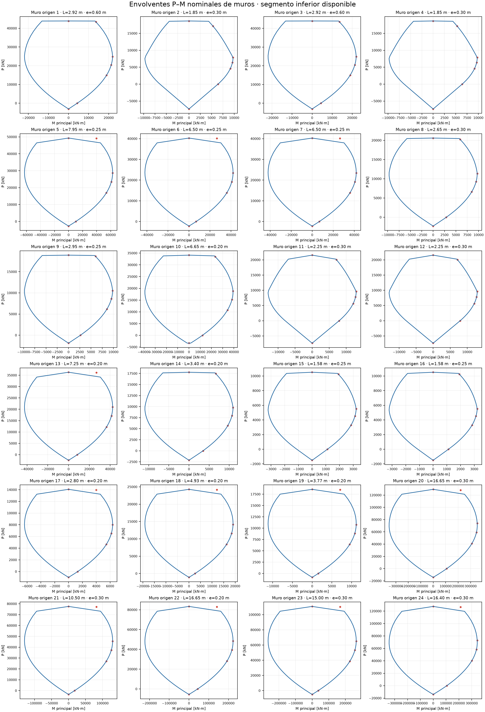

# Semana 3 — carga viva, sismo, superposición y capacidad HA

**Estado de controles numéricos: OK.** El modelo conserva la geometría y las
restricciones de Semana 2. La armadura de los pilares se tomó del detalle de
pilar 2 P.70x70 entregado: 16 barras Ø28 mm y estribos Ø12@10 cm.

## Alcance y parámetros

Unidades: kN, m, s; masas en toneladas (kN·s²/m), momentos en kN·m y giros en radianes.
Se reutilizan barras `elasticBeamColumn`, muros `ShellMITC4`, ejes locales y
diafragmas independientes LT1/LT2. No se introducen P–Delta ni materiales
no lineales en el edificio: esa linealidad permite superponer sus respuestas.
La Fiber Section no lineal se analiza por separado.

Cuatro `elasticBeamColumn` de acero SHS 300×300×20 conectan las puntas alineadas
de los voladizos: dos junto a F (`X=10,00` y `17,49 m`) entre Z=7,92 y
11,88 m; G y H entre Z=15,84 y 19,80 m.
Se adoptan E=200 GPa y ν=0,30. Son elementos elásticos con uniones rígidas en
los nodos de punta; no se comprueba aquí pandeo local, global ni conexiones.

La aceleración adoptada es 20% de g y la fracción de Q en
la masa es 50%, según la indicación recibida para este laboratorio.
Se adopta aceleración uniforme por defecto. `aceleracion_por_piso_g` permite
sobrescribirla por número de piso (por ejemplo, `{"2": 0.15}` aplica 0,15 g
al segundo nivel elevado). Se usa el mismo perfil en EX y EY como casos independientes.
El enunciado no prescribe una distribución triangular con la altura.
Es un patrón académico editable;
este cálculo no constituye una aplicación completa de NCh433 ni incluye R,
espectro, suelo, importancia o combinaciones normativas.

## A. Carga viva

`q_Q_kN_m2 = null` conserva las intensidades por zona de Semana 2. Un número
en ese campo aplica una intensidad uniforme a las mismas áreas cargadas.
Con zonas distintas se verifica Σ(q_Q,j A_j); con intensidad uniforme, q_Q A.
Se contrastan las cargas transferidas con las áreas de las zonas originales
mediante el verificador geométrico de Semana 2, independientemente de la suma
de receptores. La tolerancia es 0,002 kN por piso por redondeo del contrato.

| Cota [m] | Área origen [m²] | Q origen [kN] | Q transferida [kN] | Error [kN] |
| --- | --- | --- | --- | --- |
| 3.960000 | 711.280506 | 3027.990398 | 3027.990360 | -0.000039 |
| 7.920000 | 1367.873306 | 5427.242434 | 5427.242393 | -0.000042 |
| 11.880000 | 1391.723306 | 5536.081834 | 5536.081785 | -0.000049 |
| 15.840000 | 1494.555506 | 5268.791291 | 5268.791259 | -0.000032 |
| 19.800000 | 1486.376931 | 5346.815901 | 5346.815899 | -0.000002 |

`transferencia_Q.csv` identifica cada losa, receptor (viga o muro), área e intensidad.
En muros las resultantes se reparten entre los nodos del borde receptor. En
vigas se conserva la distribución uniforme, triangular o trapezoidal del
reparto de 45 grados y se aplica dentro del elemento mediante cuadratura de
Gauss. Cada tramo lineal conserva exactamente su fuerza y primer momento. Los
diagramas exportados integran esa carga en 41 estaciones: una carga uniforme
produce momento parabólico y una triangular/trapezoidal, su curva física de
orden superior. El máximo se busca en todas las estaciones, no sólo en extremos.

## B. Casos EX y EY

Para cada bloque y piso: W_i=1.0G_i+0.5Q_i, m_i=W_i/g,
a_i=α_i g y F_i=m_i a_i. El valor por defecto es α=0.2.
La rutina `sismo.py` recalcula masa, centro de masa y fuerza para cada piso.
`sismo_por_piso.csv` presenta los totales por nivel; `masas_y_sismo.csv`
los separa por bloque. `auditoria_masas_piso.csv` permite reconstruir el peso
y los primeros momentos a partir de cada aporte nodal. Se rechazan nodos
contados en dos pisos o pesos elevados que no pertenecen a ningún piso.
G contiene la carga permanente de losa/terminaciones, peso propio de muros y,
como adición documentada respecto de Semana 2, peso propio de vigas y columnas.
Para HA se usa γ=24.516625 kN/m³; las cuatro columnas
SHS 300×300×20 usan ρ=7850 kg/m³. Se usan sus volúmenes brutos,
sin descontar intersecciones entre elementos. Las barras aportan la mitad a
cada extremo; los paneles de muro, un cuarto a cada nodo. El peso ubicado en
la base Z=0 (1753.771 kN incluyendo la fracción de Q)
no recibe aceleración de piso. No se usan las masas arbitrarias heredadas.

El CM es el centro de la masa discretizada de cada diafragma. Esta aproximación
usa las resultantes nodales de Semana 2; no calcula el centroide exacto de todos
los polígonos de carga. En el nodo maestro se aplica F más el par de transporte:
EX: Mz=−Fx(yCM−ym); EY: Mz=Fy(xCM−xm). Equivale estáticamente a cargar el CM.
No se añade excentricidad accidental. Los giros calculados se exportan por piso.

| Bloque | Z [m] | Masa [t] | CM X [m] | CM Y [m] | F [kN] |
| --- | --- | --- | --- | --- | --- |
| LT1 | 3.960 | 480.519 | 9.581 | 8.281 | 942.457 |
| LT2 | 3.960 | 848.734 | -17.641 | 8.281 | 1664.647 |
| LT1 | 7.920 | 1270.510 | 21.480 | 7.881 | 2491.890 |
| LT2 | 7.920 | 836.309 | -17.894 | 8.299 | 1640.279 |
| LT1 | 11.880 | 1256.806 | 20.881 | 7.469 | 2465.012 |
| LT2 | 11.880 | 836.309 | -17.894 | 8.300 | 1640.279 |
| LT1 | 15.840 | 1359.181 | 23.810 | 7.539 | 2665.803 |
| LT2 | 15.840 | 842.976 | -17.713 | 8.331 | 1653.355 |
| LT1 | 19.800 | 1505.237 | 24.811 | 7.029 | 2952.267 |
| LT2 | 19.800 | 655.760 | -18.232 | 8.262 | 1286.162 |

Carga lateral total en EX y en EY: **19402.149 kN**.
Corte de apoyos en EX: **19402.150 kN**;
en EY: **19402.147 kN**.
El corte se define como la suma de reacciones externas de todos los apoyos,
incluidos los situados sobre Z=0. No es un corte exclusivo de la sección Z=0.


**Cambio solicitado en el voladizo del eje J:** se liberaron sus tres nodos
inferiores en X=50,00 m, Z=15,84 m (Y=0,00; 7,25; 16,15 m).
Se mantienen las columnas y conexiones del voladizo; se retiran las seis
restricciones externas de cada nodo. Las respuestas se recalculan con estos apoyos.

**Condición heredada que requiere contraste con planos:** hay empotramientos en
las cotas [0.0, 3.96] m. Los diafragmas incluyen nodos apoyados:
esto explica desplazamientos muy pequeños de algunos pisos y puede inhibir
la torsión. Los vínculos `equalDOF` de muros conectan nodos incluso con separación
geométrica; no equivalen a un brazo rígido con todas sus relaciones de giro.
Se conservan para no alterar silenciosamente el modelo recibido. Pasar los
controles de equilibrio y superposición no valida estas condiciones físicas.

### Trazabilidad de carga axial en pilares

`auditoria_axiales_columnas.csv` enlaza cada pilar con los pilares que comparten
exactamente su nudo superior e inferior. Para cada caso registra la compresión
del tramo, la suma de compresiones de los tramos inmediatamente superiores y
el aporte vertical neto del nudo. Se verifica fila a fila:

`P_tramo = suma(P_superiores) + aporte_neto_nudo`.

Los 128 pilares tienen continuidad nodal `OK`; por tanto las acciones de los
pilares superiores sí entran al equilibrio de los inferiores. El aporte del
nudo incluye la transferencia de vigas, muros, cargas nodales y restricciones.
Puede ser negativo porque el pórtico tridimensional redistribuye carga por las
vigas hacia otros pilares o hacia los apoyos elevados. Forzar que el axial sea
siempre creciente hacia abajo alteraría el resultado de equilibrio de OpenSees.
Unity muestra ahora estos tres valores y los ID de los pilares superiores al
seleccionar una columna. La capacidad HA continúa usando la fuerza del análisis
global; la tabla de trazabilidad sirve para explicar su camino de carga.

Se emplea `Penalty` con α=1.0e+14. En nodos que también participan en
restricciones multipunto, `nodeReaction` es el residuo Ku−P y no representa
por sí solo la reacción externa. Para cada DOF apoyado se obtiene R=−αu;
se verifica su equilibrio con las fuerzas aplicadas y sensibilidad con α×10.
`*.npz` distingue `nodal_residual` de `reaction` en los apoyos.

## C. Superposición

Combinación de demostración: **R=1.2G + 1.4Q
+ 0.8EX + (-0.3)EY**.
Cada caso parte de `wipe()` y de la misma rigidez. Se eliminan los patrones
automáticos G+Q antes de cargar. R se resuelve nuevamente con la suma explícita
de cargas; no se obtiene del resultado superpuesto para efectuar la comparación.

| Respuesta | Muestra | Superpuesta | Explícita | Error relativo máximo |
| --- | --- | --- | --- | --- |
| desplazamientos | nodo 900116, DOF 3 | -0.0336096579 | -0.033609658 | 2.21780045e-08 |
| reacciones de apoyo | nodo 700006, DOF 3 | 8074.70644 | 8074.70644 | 6.63695634e-08 |
| fuerzas internas | elemento 684, componente global 3 | 16654.5052 | 16654.5101 | 3.51860026e-07 |

La comparación abarca todos los DOF, todos los apoyos y todas las componentes
de fuerzas nodales resistentes de barras y shells, con tags ordenados.
La tabla muestra una componente de máxima magnitud de cada familia; el error
relativo usa la norma máxima de toda la familia. Fuerzas `eleForce` en ejes
globales: componentes traslacionales en kN y rotacionales en kN·m.
En desplazamientos: DOF 1–3 en m; 4–6 en rad. Los archivos completos permiten
reconstruir cualquier combinación posterior, dentro de la hipótesis lineal.

## D. Columna de hormigón armado

Sección 0.70 × 0.70 m, compatible con A=0,49 m² del modelo.
**Datos tomados del detalle de pilares:** f'c=35.0 MPa,
fy=420.0 MPa, Es=210000.0 MPa;
16 barras longitudinales (16 barras Ø28 mm);
distancia cara–centro de barra 73 mm;
estribos Ø12 @ 10 cm.
As=9852.0 mm²; cuantía=2.011%.

`Concrete01`: compresión negativa, pico −f'c a −0.002, resistencia
residual nula a −0.0035, sin tracción. Para mantener la hipótesis
académica de esta curva, los estribos conocidos se reportan pero no se modela
confinamiento constitutivo adicional.
`Steel01`: elastoplástico perfecto, b=0. La discretización parte de una malla
40 × 40; descuenta el área ocupada por
las barras de las celdas vecinas e incorpora fibras de acero separadas.
Total de fibras activas: 1584. Error Ac+As−Ag: 0.00e+00 m².

La sección se instancia en OpenSees como `Fiber` y `zeroLengthSection`.
Se aplica P constante y luego curvatura creciente con `DisplacementControl`.
La curva se detiene al cruzar εc=−0.0035 en la cara extrema o
|εs|=0.05; el último paso puede exceder levemente el límite y
se excluye al elegir la capacidad. Se controla equilibrio axial en cada paso.


| P [kN] (+ compresión) | M máximo [kN·m] | φ al máximo [1/m] |
| --- | --- | --- |
| 14737.805190 | 0.000000 | 0.000000 |
| 14175.561893 | 1191.280881 | 0.004286 |
| 6429.590966 | 2045.976242 | 0.007974 |
| 5980.196771 | 1994.315867 | 0.009569 |
| 3098.850825 | 1801.402435 | 0.012759 |
| 0.000000 | 1194.839601 | 0.024336 |
| -4137.854516 | 0.000000 | 0.000000 |

Los siete puntos A–G del diagrama P–M se calculan con compatibilidad lineal de
deformaciones, equilibrio de fuerzas, bloque rectangular de Whitney y acero
elastoplástico. La compresión pura considera el límite axial definido en los
parámetros. La línea discontinua conecta los estados calculados y no constituye
por sí sola una verificación normativa completa.

Interpretación: la compresión moderada aumenta el momento máximo respecto de
P=0, pero reduce la curvatura que puede alcanzarse. Las ramas descendentes
muestran degradación del hormigón. Al acercarse a compresión pura la capacidad
de momento tiende a cero. Son capacidades nominales del modelo de sección:
no incluyen factores de reducción, confinamiento, pandeo de barras, cortante,
esbeltez de columna ni comprobación demanda/capacidad del edificio.

Como comprobación adicional se integra la envolvente de materiales por
compatibilidad de deformaciones (`PM_compatibilidad_envolvente_material.csv`).
Sus valores al límite de deformación no deben confundirse con los picos de
M–φ: Concrete01 considera descarga/recarga en la historia de precarga y flexión.
Al duplicar las divisiones de la malla, el cambio máximo de ese cálculo es
0.074%. Al refinar malla y paso de curvatura, el cambio
máximo de los picos OpenSees es 0.186%.
Error axial máximo: 8.883e-08 kN. Estado HA: **OK**.

## Curvas P-M de muros

Se calcularon envolventes nominales para **24 muros** y
**82 secciones** según los cambios de armadura en altura. Los
resultados se guardan en `results/PM_muros_envolvente.csv`,
`results/PM_muros_puntos_clave.csv` y `results/resumen_capacidad_muros.json`.



## Controles automáticos

| Control | Error | Tolerancia | Estado |
| --- | --- | --- | --- |
| G: equilibrio apoyos / carga | 6.516e-09 | 1.000e-04 | OK |
| G: compatibilidad diafragmas [m] | 4.929e-10 | 1.000e-05 | OK |
| Q: equilibrio apoyos / carga | 3.079e-09 | 1.000e-04 | OK |
| Q: compatibilidad diafragmas [m] | 1.562e-10 | 1.000e-05 | OK |
| EX: equilibrio apoyos / carga | 5.913e-08 | 1.000e-04 | OK |
| EX: compatibilidad diafragmas [m] | 1.687e-10 | 1.000e-05 | OK |
| EX: carga lateral total [kN] | 0.000e+00 | 1.000e-07 | OK |
| EX: resultante aplicada equivalente a fuerzas en CM [kNm] | 0.000e+00 | 1.000e-06 | OK |
| EX: corte basal relativo | 5.912e-08 | 1.000e-04 | OK |
| EX: pisos con desplazamiento contrario | 0.000e+00 | 0.000e+00 | OK |
| EX: F=m*a piso 1 LT1 | 0.000e+00 | 1.000e-07 | OK |
| EX: F=m*a piso 1 LT2 | 0.000e+00 | 1.000e-07 | OK |
| EX: F=m*a piso 2 LT1 | 0.000e+00 | 1.000e-07 | OK |
| EX: F=m*a piso 2 LT2 | 0.000e+00 | 1.000e-07 | OK |
| EX: F=m*a piso 3 LT1 | 0.000e+00 | 1.000e-07 | OK |
| EX: F=m*a piso 3 LT2 | 0.000e+00 | 1.000e-07 | OK |
| EX: F=m*a piso 4 LT1 | 0.000e+00 | 1.000e-07 | OK |
| EX: F=m*a piso 4 LT2 | 0.000e+00 | 1.000e-07 | OK |
| EX: F=m*a piso 5 LT1 | 0.000e+00 | 1.000e-07 | OK |
| EX: F=m*a piso 5 LT2 | 0.000e+00 | 1.000e-07 | OK |
| EX: momento aplicado respecto al CM [kNm] | 0.000e+00 | 1.000e-07 | OK |
| EY: equilibrio apoyos / carga | 7.359e-08 | 1.000e-04 | OK |
| EY: compatibilidad diafragmas [m] | 2.344e-09 | 1.000e-05 | OK |
| EY: carga lateral total [kN] | 0.000e+00 | 1.000e-07 | OK |
| EY: resultante aplicada equivalente a fuerzas en CM [kNm] | 0.000e+00 | 1.000e-06 | OK |
| EY: corte basal relativo | 7.359e-08 | 1.000e-04 | OK |
| EY: pisos con desplazamiento contrario | 0.000e+00 | 0.000e+00 | OK |
| EY: F=m*a piso 1 LT1 | 0.000e+00 | 1.000e-07 | OK |
| EY: F=m*a piso 1 LT2 | 0.000e+00 | 1.000e-07 | OK |
| EY: F=m*a piso 2 LT1 | 0.000e+00 | 1.000e-07 | OK |
| EY: F=m*a piso 2 LT2 | 0.000e+00 | 1.000e-07 | OK |
| EY: F=m*a piso 3 LT1 | 0.000e+00 | 1.000e-07 | OK |
| EY: F=m*a piso 3 LT2 | 0.000e+00 | 1.000e-07 | OK |
| EY: F=m*a piso 4 LT1 | 0.000e+00 | 1.000e-07 | OK |
| EY: F=m*a piso 4 LT2 | 0.000e+00 | 1.000e-07 | OK |
| EY: F=m*a piso 5 LT1 | 0.000e+00 | 1.000e-07 | OK |
| EY: F=m*a piso 5 LT2 | 0.000e+00 | 1.000e-07 | OK |
| EY: momento aplicado respecto al CM [kNm] | 0.000e+00 | 1.000e-07 | OK |
| R: equilibrio apoyos / carga | 3.272e-08 | 1.000e-04 | OK |
| R: compatibilidad diafragmas [m] | 1.378e-09 | 1.000e-05 | OK |
| EXG: equilibrio apoyos / carga | 2.069e-07 | 1.000e-04 | OK |
| EXQ: equilibrio apoyos / carga | 3.221e-07 | 1.000e-04 | OK |
| EX: bases de masa reproducen u | 3.817e-07 | 1.000e-05 | OK |
| EX: bases de masa reproducen support_r | 9.840e-08 | 1.000e-05 | OK |
| EX: bases de masa reproducen demanda de muro P_compresion_kN | 1.326e-06 | 1.000e-05 | OK |
| EX: bases de masa reproducen demanda de muro M_principal_kNm | 3.266e-07 | 1.000e-05 | OK |
| EYG: equilibrio apoyos / carga | 1.970e-07 | 1.000e-04 | OK |
| EYQ: equilibrio apoyos / carga | 4.876e-08 | 1.000e-04 | OK |
| EY: bases de masa reproducen u | 5.761e-07 | 1.000e-05 | OK |
| EY: bases de masa reproducen support_r | 8.878e-08 | 1.000e-05 | OK |
| EY: bases de masa reproducen demanda de muro P_compresion_kN | 9.957e-07 | 1.000e-05 | OK |
| EY: bases de masa reproducen demanda de muro M_principal_kNm | 3.670e-07 | 1.000e-05 | OK |
| EX: masa 0.8G+0.3Q explícita u | 8.553e-07 | 1.000e-05 | OK |
| EX: masa 0.8G+0.3Q explícita support_r | 5.025e-07 | 1.000e-05 | OK |
| EX: masa 0.8G+0.3Q explícita local_forces | 6.897e-07 | 1.000e-05 | OK |
| EY: masa 0.8G+0.3Q explícita u | 4.495e-07 | 1.000e-05 | OK |
| EY: masa 0.8G+0.3Q explícita support_r | 3.904e-07 | 1.000e-05 | OK |
| EY: masa 0.8G+0.3Q explícita local_forces | 4.031e-07 | 1.000e-05 | OK |
| Q: conservacion piso 3.96 [kN] | 3.874e-05 | 2.000e-03 | OK |
| Q: conservacion piso 7.92 [kN] | 4.168e-05 | 2.000e-03 | OK |
| Q: conservacion piso 11.88 [kN] | 4.855e-05 | 2.000e-03 | OK |
| Q: conservacion piso 15.84 [kN] | 3.188e-05 | 2.000e-03 | OK |
| Q: conservacion piso 19.8 [kN] | 1.961e-06 | 2.000e-03 | OK |
| Superposicion: desplazamientos, error relativo maximo | 2.218e-08 | 1.000e-05 | OK |
| Superposicion: reacciones de apoyo, error relativo maximo | 6.637e-08 | 1.000e-05 | OK |
| Superposicion: fuerzas internas, error relativo maximo | 3.519e-07 | 1.000e-05 | OK |
| Superposicion: demanda de muros P_compresion_kN, error relativo maximo | 4.445e-08 | 1.000e-05 | OK |
| Superposicion: demanda de muros M_principal_kNm, error relativo maximo | 2.657e-07 | 1.000e-05 | OK |
| Superposicion: demanda de muros V_en_plano_kN, error relativo maximo | 2.069e-07 | 1.000e-05 | OK |
| Superposicion: demanda de muros V_fuera_plano_kN, error relativo maximo | 3.543e-07 | 1.000e-05 | OK |
| EX: sensibilidad penalty x10 | 3.768e-05 | 1.000e-02 | OK |
| EY: sensibilidad penalty x10 | 8.349e-04 | 1.000e-02 | OK |

El comando termina con código distinto de cero si cualquier control resulta
REVISAR. Los supuestos físicos pendientes se mantienen visibles aunque los
controles numéricos estén OK. `manifest.json` registra hashes de entradas y
versiones del entorno para poder identificar la corrida.

## Integración con Unity

El visor de Semana 3 se integró en
`Edificio/visualization/unity/UnityVisualization`; no se creó una segunda escena. El panel izquierdo
mantiene la inspección de geometría y áreas tributarias de Semana 2. El panel
derecho permite seleccionar G, Q, EX, EY o R, ajustar la escala de la deformada,
mostrar fuerzas laterales y centros de masa y consultar dentro de Unity la
discretización Fiber, las curvas M–φ y los primeros puntos P–M.

En `Ponderadores de masa sísmica` se editan αG y αQ (valores iniciales
`ponderador_G_masa` y `fraccion_Q_masa`). `Aplicar masa` actualiza masas,
centros de masa, fuerzas, deformadas y esfuerzos EX/EY; también reconstruye R
con sus λ ya aplicados. No modifica las cargas gravitacionales G/Q.
Las bases EXG/EXQ/EYG/EYQ son corridas OpenSees independientes; sus respuestas
se suman gracias a la rigidez estática lineal. Se contrastan desplazamientos,
reacciones y fuerzas internas con corridas explícitas de ponderadores distintos.
Se conserva la aceleración especificada: cambia F, no a. Los valores de Unity
duran la sesión de Play; para cambiar los valores iniciales, editar parámetros
y regenerar. No se admiten ponderadores negativos ni pisos de masa nula.

`Edificio/analysis/load_cases/ejecutar.py` exporta cada corrida a
`Edificio/visualization/unity/UnityVisualization/Assets/Resources/semana3_*.csv`. Las líneas coloreadas
son la estructura deformada y se superponen a la geometría original. Los
archivos de respuesta completos siguen disponibles en `Edificio/results/`.

Abrir `Edificio/visualization/unity/UnityVisualization/Assets/Main.unity`. Para reconstruir el ejecutable,
usar `Build > Edificio Viewer > Construir EXE`. El resultado queda en
`Edificio/visualization/unity/UnityVisualization/Build/EdificioViewer.exe`.

## Reproducción y archivos

Desde la raíz del proyecto, ejecutar:

```powershell
python -m pip install -r Edificio/requirements.txt
python Edificio/analysis/load_cases/ejecutar.py
```

Editar `Edificio/data/parameters/parametros.json` y volver a ejecutar para cambiar q_Q, aceleración,
fracción de Q, combinación o sección. También se admite `--parametros archivo.json`.
Los resultados se regeneran en `Edificio/results/`, este informe en
`Edificio/documentation/INFORME.md` y los recursos del visor dentro del proyecto Unity de Edificio.
El análisis numérico puede ejecutarse sin
abrir Unity; para visualizar cambios hay que volver a abrir o reconstruir el visor.

Para la demostración: mostrar primero conservación de Q; luego masas, CM,
fuerzas y giros; comparar R con la suma de casos; por último explicar la malla
de fibras, los materiales y los siete puntos A–G del diagrama P–M. Antes de presentar como
modelo validado del edificio, contrastar apoyos y armadura con los planos.

## Referencia de implementación

La configuración `Fiber`/`zeroLengthSection` y el control de curvatura siguen
el procedimiento documentado en [OpenSeesPy: Moment Curvature Analysis](https://openseespydoc.readthedocs.io/en/latest/src/MomentCurvature.html).
La geometría, las cargas y las restricciones provienen de los archivos locales
identificados en el manifiesto.
