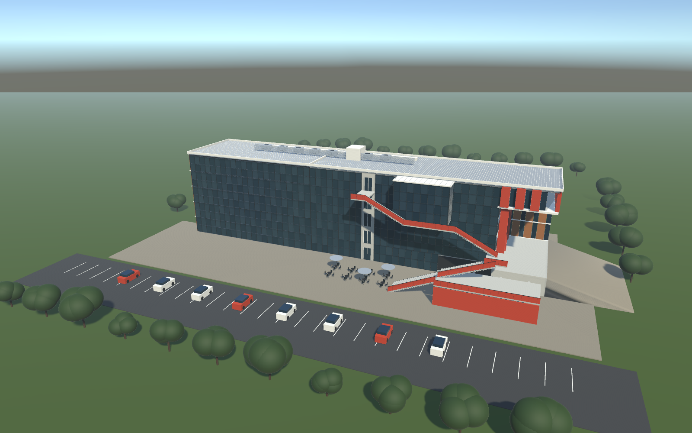
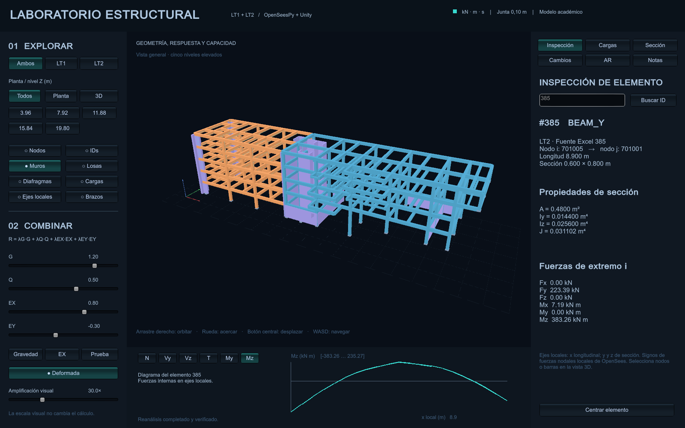
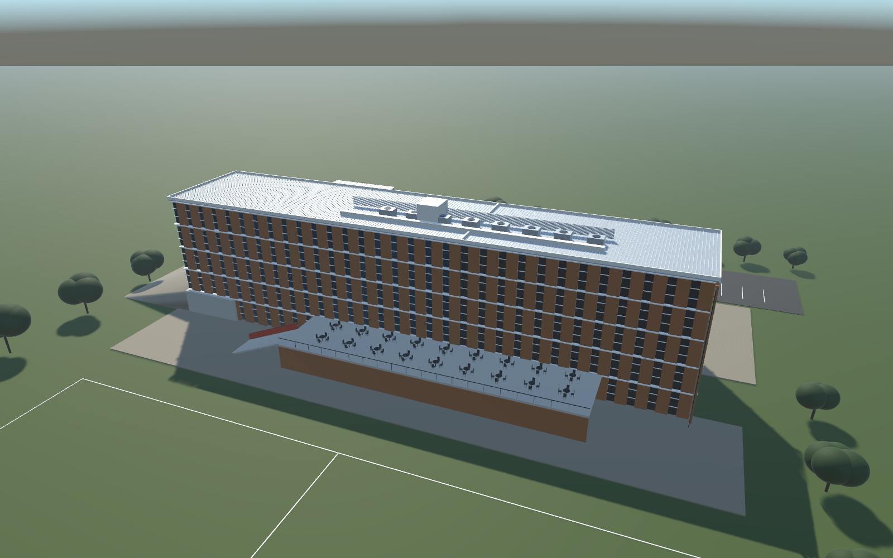

# Edificio de Ingeniería: OpenSeesPy y Unity

Laboratorio académico de dos bloques estructurales con junta de 10 cm y una recreación arquitectónica independiente basada en fotografías del mismo conjunto.



## Organización

```text
LaboratorioEstructural/
  python/                   Modelo, cálculo y comprobaciones OpenSeesPy
  Unity/                    Proyecto del visor estructural
  documentacion/            Hipótesis, contrato de datos y guía de demostración
  config.json               Parámetros y correcciones de geometría
RecreacionArquitectonica/
  Unity/                    Escena arquitectónica, materiales, prefab y código
    Assets/Referencias/     Fotografías utilizadas
  LEEME.md                  Controles, dimensiones y aproximaciones
docs/imagenes/              Vistas de referencia para este README
modelo_estructural_completo.xlsx
```

Cada carpeta `Unity` es un proyecto distinto. Las carpetas `Aplicacion`, `resultados`, `Capturas`, `work` y las cachés se generan localmente y están excluidas de Git. El Excel permanece en la raíz porque el importador lo encuentra mediante una ruta relativa.

## Requisitos

- Python 3.12, versión utilizada en las comprobaciones originales.
- Unity 6000.5.9f1, con Windows Build Support para generar los ejecutables.
- Windows y PowerShell para los scripts de compilación incluidos.

## Calcular el modelo estructural

Desde la raíz del repositorio, en PowerShell:

```powershell
python -m venv .venv
.\.venv\Scripts\python.exe -m pip install -r LaboratorioEstructural/python/requirements.txt
.\.venv\Scripts\python.exe LaboratorioEstructural/python/run_project.py
.\.venv\Scripts\python.exe LaboratorioEstructural/python/test_project.py
```

El cálculo debe ejecutarse antes de abrir el visor estructural. Genera `resultados/proyecto.json` y su copia en `Unity/Assets/StreamingAssets`, con las rutas del equipo donde se ejecutó. Así, Unity puede cargar los resultados y solicitar reanálisis usando ese intérprete de Python.

En Unity Hub, añadir `LaboratorioEstructural/Unity`, abrir `Assets/Scenes/Laboratorio.unity` y pulsar Play. Para compilar el visor:

```powershell
powershell -ExecutionPolicy Bypass -File LaboratorioEstructural/Compilar_Unity.ps1
```

Después, ejecutar `INICIAR_LABORATORIO.cmd`.

## Abrir la recreación arquitectónica

En Unity Hub, añadir `RecreacionArquitectonica/Unity`, abrir `Assets/Scenes/Recreacion.unity` y pulsar Play. La geometría y los materiales ya están guardados y son editables.

Para compilar el visor independiente:

```powershell
powershell -ExecutionPolicy Bypass -File RecreacionArquitectonica/Compilar.ps1
```

Después, ejecutar `ABRIR_RECREACION_ARQUITECTONICA.cmd`. Si Unity está instalado en otra ubicación, indicar `-UnityExe` al script estructural o `-EditorPath` al arquitectónico.

Regenerar la recreación sobrescribe su escena y prefab generados; guardar las modificaciones manuales con otro nombre antes de recompilar mediante el generador.

## Alcance

El modelo global es lineal elástico, con seis grados de libertad por nodo, muros equivalentes y diafragmas rígidos. Incluye los casos G, Q, EX y EY. Las 29 bases de columnas están empotradas; se conserva la corrección de los tres pilares del eje I, que arrancan en Z=3,96 m.

Las curvas momento–curvatura y P–M se calculan por separado con secciones de fibras y armaduras didácticas, pendientes de sustituir por los detalles reales. El proyecto es académico y no constituye una validación del diseño construido.

La arquitectura interpreta las fotografías: la fachada ocre y la de vidrio son caras opuestas del mismo conjunto. Topografía, interiores y detalles no visibles son aproximados.




## Documentación

- [Laboratorio estructural](LaboratorioEstructural/LEEME.md)
- [Decisiones del modelo](LaboratorioEstructural/documentacion/DECISIONES_MODELO.md)
- [Recreación arquitectónica](RecreacionArquitectonica/LEEME.md)
- [Preparación para GitHub](docs/GITHUB.md)
