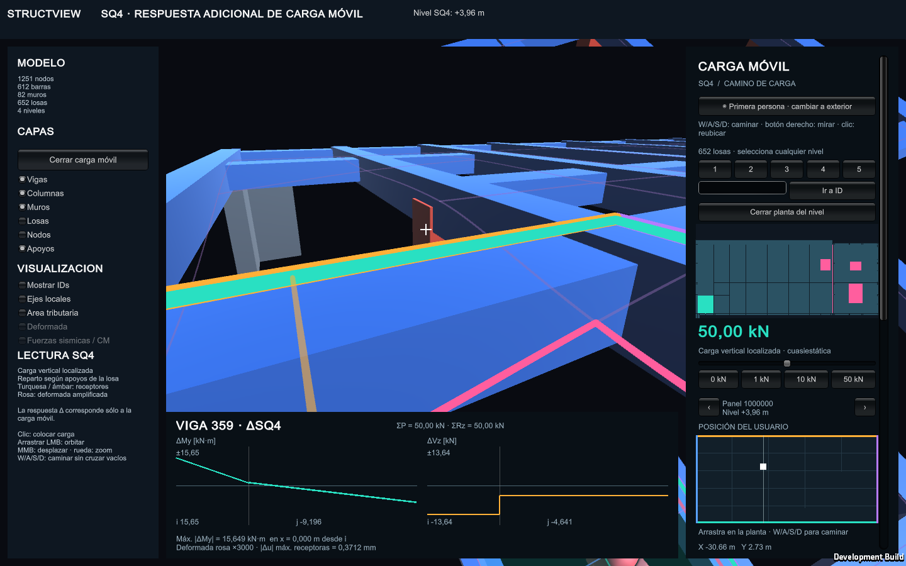
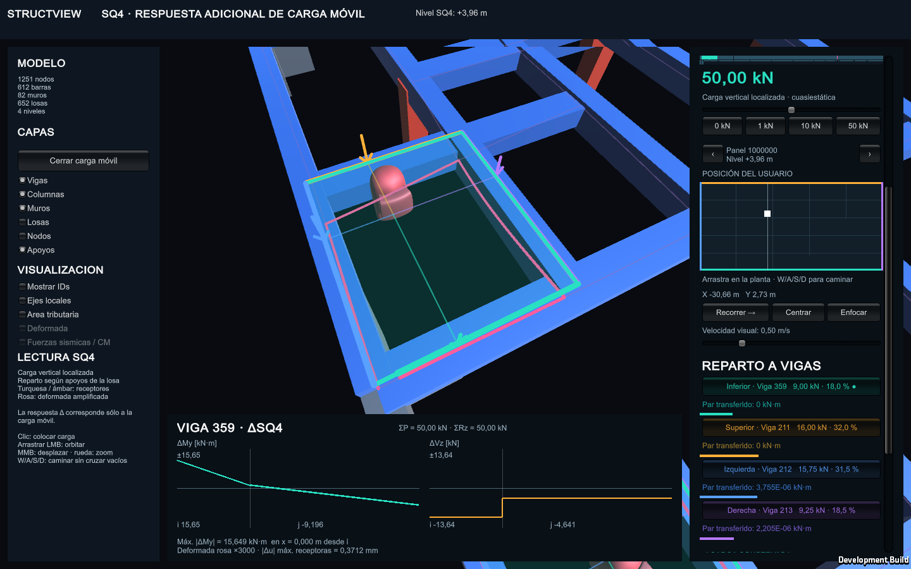
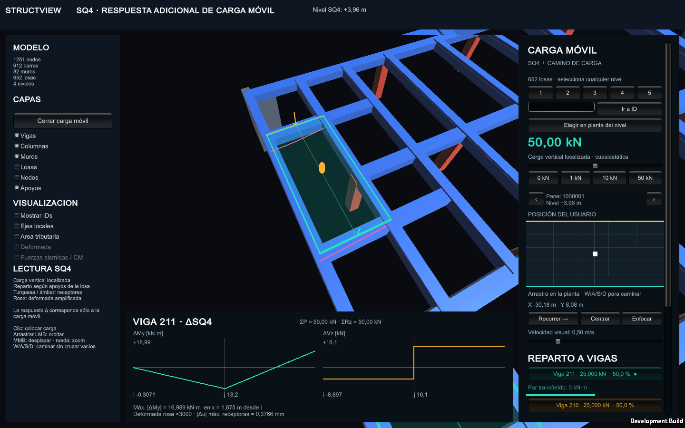
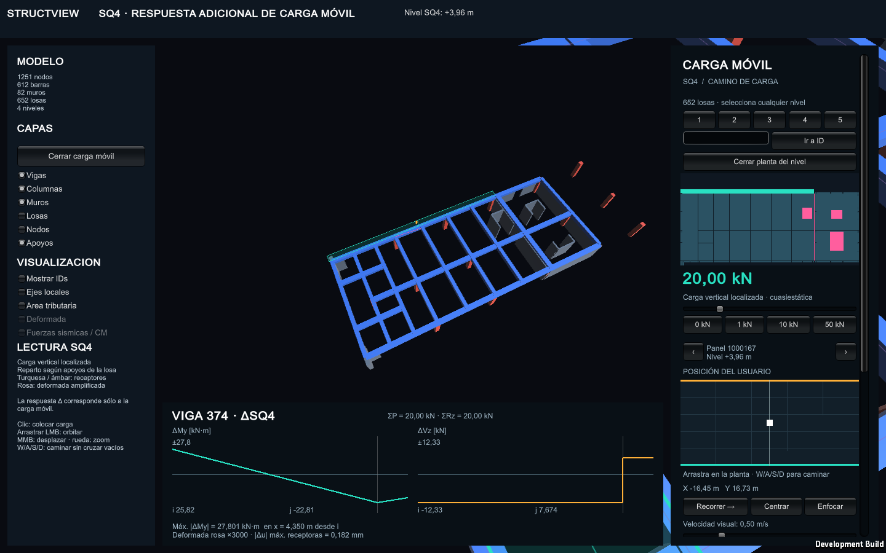
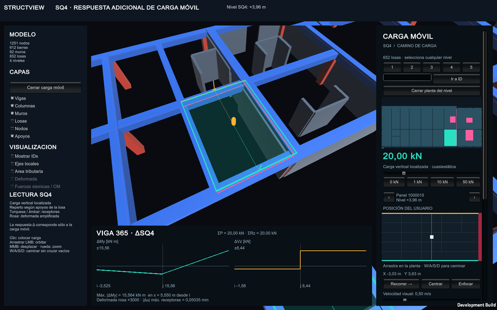
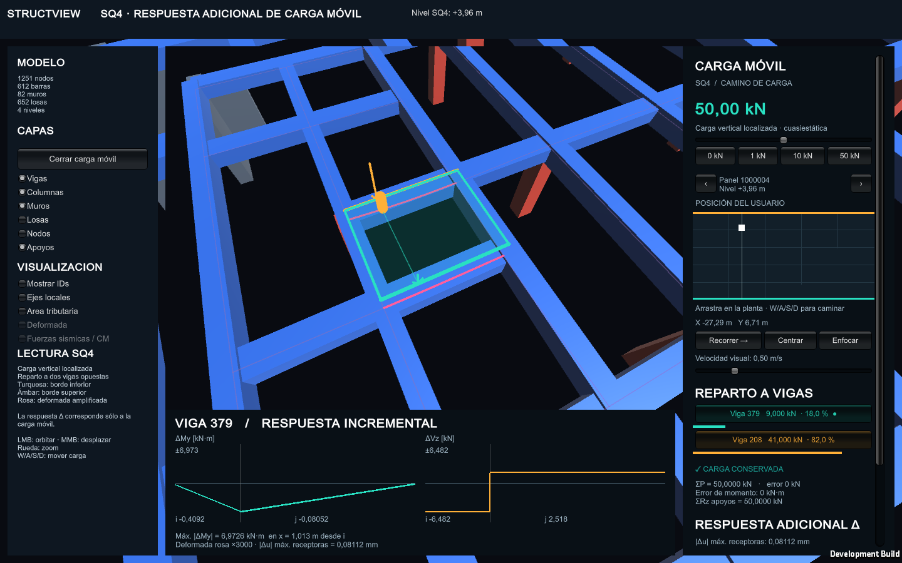
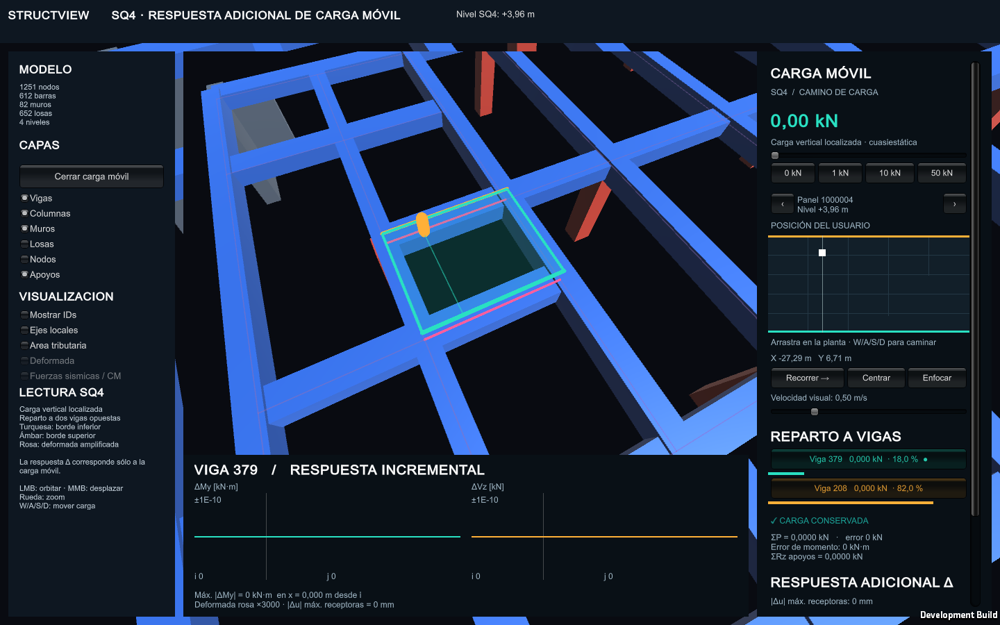

# Informe P1A5 - Laboratorio estructural interactivo v1

## Datos generales

| Campo | Informacion |
|---|---|
| Asignatura | Metodos Computacionales en Ingenieria de Obras Civiles |
| Laboratorio | Semana 5 - P1L5 (objetivo) y P1A5 (entregable) |
| Enunciados | `Enunciados e Instrucciones/SEMANA_5/P1L5_LAB_interaccion_modificacion_y_experiencia_estructural_Objetivo.txt` y `P1A5_AVANCE_laboratorio_estructural_interactivo_v1_Entregable.txt` |
| Modelo | Edificio 3D en OpenSees y visor interactivo en Unity |
| Ejecucion | `Edificio/analysis/load_cases/ejecutar.py` |
| Escena Unity | `Edificio/visualization/unity/UnityVisualization/Assets/Main.unity` |
| Version de Unity | 6000.5.10f1 |
| Unidades | kN, m, s, radianes y kN/m2 |
| Repositorio | https://github.com/jpCaceres123/Proyecto-1-MCOC |

## Introduccion

El objetivo de esta entrega es transformar el visor en un laboratorio estructural
interactivo. Esta semana se completa la interaccion obligatoria, se incorporan dos
categorias de modificacion ejecutadas **desde la propia interfaz de Unity**, se
verifica la superposicion interactiva contra soluciones explicitas y se mantiene
el sidequest de carga movil SQ4 con la vista en primera persona.

La corrida base contiene 1251 nodos, 694 elementos, 82 panos de muro separados
por piso y 652 paneles de losa en cinco niveles
(`Z = 3.96, 7.92, 11.88, 15.84 y 19.80 m`). La separacion de muros conserva los
nodos compartidos entre niveles, por lo que no introduce desconexiones
estructurales.

El visor funciona como postprocesador y, a partir de esta entrega, tambien como
orquestador del reanalisis: Unity escribe una solicitud de modificacion, ejecuta
Python/OpenSees en una carpeta de trabajo aislada y recarga la escena con la
respuesta del modelo modificado. El repositorio original nunca se sobrescribe.

## 1. Funciones implementadas

La palabra implementada describe la existencia y la comprobacion numerica de la
funcion. La columna de alcance distingue lo que tiene comprobacion automatizada de
lo que todavia requiere una prueba visual en ejecucion. **La verificacion visual
de los controles nuevos de esta semana esta pendiente**: el ejecutable Windows
disponible es del 22-09-2026 y todavia no contiene el panel de modificacion.

| Funcion | Estado | Implementacion y limite |
|---|---|---|
| Navegacion | Implementada y probada en escritorio | `OrbitCamera.cs`: orbita, zoom, desplazamiento y reinicio de vista. Gestos de uno y dos dedos. El modo SQ4 agrega vista en primera persona con W/A/S/D y giro con boton derecho. |
| Seleccion | Implementada y probada en escritorio | `ElementInspector.cs`: raycast, resaltado, filtros por tipo, busqueda y lista por ID. El arrastre cancela la seleccion. Elementos interiores pueden quedar ocluidos. |
| Activar/desactivar capas | Implementada | `BuildingVisualizer.cs` y el panel de capas ocultan geometria, apoyos, ejes, cargas y deformada. Ocultar una capa no modifica el modelo ni la carga fisica. |
| Apoyos | Implementada | `BuildingVisualizer.cs` visualiza las restricciones exportadas. El simbolo no reemplaza una tabla de los seis GDL. |
| Ejes | Implementada | Se muestran `xlocal`, `ylocal` y `zlocal`. OpenSees usa XYZ y Unity representa la vertical Z como Y. |
| Cargas | Implementada, ahora editable por elemento | `Semana3Visualizer.cs` muestra G, Q, EX, EY y R. `ModelVariantPanel.cs` permite modificar la carga de un elemento: Q adicional en barras y borde superior de muros, y Q superficial en losas. No es un editor libre de cargas nodales. |
| Areas tributarias | Parcial | La transferencia y conservacion numerica estan implementadas. El dibujo interactivo es aproximado y no debe usarse para medir el reparto exacto. |
| Deformada | Implementada, ahora por elemento | Deformada global amplificada y, desde esta entrega, deformada del elemento seleccionado en `StructuralPostprocessor.cs`, con grafico de `|u|` en mm. La amplificacion visual no es desplazamiento fisico. |
| Diagramas | Implementada para barras | Se muestran N, Vy, Vz, My y Mz en 41 estaciones por barra. |
| Superposicion | Implementada y verificada | Se combinan G, Q, EX y EY mediante ponderadores lambda sin ejecutar Python. Verificada con 120 controles bajo tolerancia relativa 1e-5. |
| P-M | Implementada, nominal y uniaxial | `SectionGraphs.cs` y `WallSectionGraphs.cs` muestran capacidad y demanda de columnas y panos de muro. Se bloquea cuando la seccion de la columna fue editada, para no presentar una capacidad antigua. |
| Modificacion del modelo | Implementada y verificada | Dos categorias automatizadas desde Unity: intensidad de carga y seccion. Ademas existe un flujo manual reproducible con `verificar_modificaciones.py`. |
| Sidequest SQ4 | Implementada y verificada | Carga movil sobre 652 paneles con reparto a cuatro vigas, conservacion de fuerza y par, respuesta incremental y vista en primera persona. |

## 2. Flujo de integracion

### 2.1 Analisis y postproceso

```text
datos de entrada
    -> analisis Python/OpenSees
    -> resultados CSV, JSON y NPZ
    -> exportacion de Resources
    -> carga de la escena Unity
    -> seleccion e inspeccion visual
```

El contrato principal es `Edificio/results/modelo_3d_manual.json`. Los
identificadores, nodos, conectividades, propiedades y casos se conservan desde el
modelo hasta el objeto visual. En muros, `source_wall_id` y `floor` permiten
relacionar cada pano con su muro de origen y su nivel.

### 2.2 Reanalisis desde la interfaz

```text
seleccion en Unity -> ModelVariantPanel
    -> request.json con IDs y valores
    -> analysis/load_cases/unity_reanalizar.py
    -> copia de trabajo en AnalysisJobs/<id>/
    -> generar_modelo_manual.py + ejecutar.py (OpenSees)
    -> exportacion de Resources de la variante
    -> complete.json con estado y hashes
    -> AnalysisResources.Activate + recarga de escena
```

Cada trabajo queda en `Application.persistentDataPath/AnalysisJobs/<id>/` con la
solicitud, una copia selectiva del codigo y los datos, los resultados, los
recursos y `analysis.log`. El estado base se conserva intacto y se recupera con
**Restaurar modelo base**. Si el proceso termina en `REVISAR` o falla, Unity
mantiene la ultima respuesta valida e informa la ruta del registro.

## 3. Modificaciones completas

El enunciado exige al menos dos categorias modificables y **indicar cuando
requiere reanalisis**. Las dos implementadas son **intensidad de carga** y
**seccion**, y ambas se ejecutan desde la interfaz.

### 3.1 Intensidad de carga

| Seleccion | Efecto de la carga Q |
|---|---|
| Viga o columna | Carga uniforme **adicional**, vertical global -Z, en kN/m |
| Muro | Carga **adicional** en el borde superior del pano, en kN/m |
| Losa | Intensidad superficial Q **total**, en kN/m2; reemplaza la Q original de esa losa |

Cadena `interfaz -> dato -> modelo -> OpenSees -> resultados -> Unity`:

1. **Interfaz**: se marca la casilla de carga en **Configurar carga / seccion** y
   se escribe el valor; se acepta coma o punto decimal.
2. **Dato**: `ModelVariantPanel.cs` escribe un `request.json` con el tipo, el ID y
   el valor. `variantes_interactivas.py` valida que el valor sea no negativo y
   finito y lo guarda en la geometria como `interactive_Q_kN_m` o
   `interactive_q_kN_m2` del elemento.
3. **Modelo**: `generar_modelo_manual.py` aplica el cambio antes de exportar la
   geometria. `casos.py` agrega la carga al caso Q y descuenta el peso
   sismico correspondiente cuando la carga es adicional sobre una barra o un muro.
4. **OpenSees**: se vuelven a resolver G, Q, EX, EY y R. Las bases de masa EXG,
   EXQ, EYG y EYQ se reconstruyen cuando la carga viva cambia.
5. **Resultados**: `ejecutar.py` regenera CSV, JSON y NPZ, incluida la
   conservacion de Q por piso y la auditoria de masas.
6. **Unity**: `AnalysisResources.Activate` carga la instantanea completa de la
   variante y la escena se recarga conservando la seleccion.

Verificacion: el trabajo aislado con la viga 207 (Q adicional 2 kN/m) y el trabajo
combinado con la losa 1000000 (Q 4 kN/m2) terminaron en `OK`, con equilibrio,
conservacion de Q por piso y superposicion dentro de tolerancia. La regla de
conservacion sustituye unicamente la Q original de la losa editada por
`q_nueva * area_neta_geometrica`, sin cambiar tolerancias.

Las cargas adicionales de barras y muros **se suman** a las cargas originales:
introducir cero las elimina. No representan edicion del peso propio G.

### 3.2 Seccion

| Seleccion | Propiedad editable |
|---|---|
| Viga o columna de hormigon | Ancho `b` y alto `h` de seccion rectangular, en m |
| Columna tubular de acero | Ancho exterior y espesor de pared SHS; conserva seccion hueca y material |
| Muro | Espesor del pano seleccionado, en m |
| Losa | Espesor, en m; cambia peso propio y masa |

Cadena `interfaz -> dato -> modelo -> OpenSees -> resultados -> Unity`:

1. **Interfaz**: se marca la casilla de seccion en el panel y se escriben las
   dimensiones, que deben ser positivas y finitas.
2. **Dato**: la solicitud viaja en el mismo `request.json` y
   `variantes_interactivas.py` calcula `A`, `Iy = h*b^3/12`, `Iz = b*h^3/12` y el
   modulo de torsion de Saint-Venant. Para espesores se registra el valor y la
   carga Q original del pano, para conservar la auditoria posterior.
3. **Modelo**: el override se aplica por **ID del elemento analitico**. Cambia
   `A`, `Iy`, `Iz`, `J`, el peso propio G, la masa sismica, el elemento
   `elasticBeamColumn` y la geometria que Unity dibuja. En muros actualiza la
   rigidez Shell y la capacidad con la armadura registrada.
4. **OpenSees**: se vuelven a resolver todos los casos; las respuestas sismicas
   cambian porque cambia la masa.
5. **Resultados**: se regeneran las tablas, las curvas de capacidad de muros y el
   hash del modelo exportado.
6. **Unity**: la escena se recarga con las dimensiones y la capacidad nuevas.

Verificacion: el trabajo aislado con la viga 207 a 0.75 x 0.45 m, y el trabajo
combinado con la columna 1 a 0.75 x 0.75 m, el muro 101 a 0.65 m de espesor y la
losa 1000000 a 0.18 m, terminaron en `OK` con conservacion por piso aprobada.

**Reanalisis requerido: si.** La capacidad de una columna con seccion editada no
se recalcula con la rutina generica de 0.70 x 0.70 m, por lo que sus pestanas de
capacidad se bloquean en lugar de mostrar un valor antiguo. Esfuerzos y deformada
si se recalculan.

### 3.3 Cuando se requiere reanalisis

| Cambio | Reanalisis |
|---|---|
| Lambda sobre bases del mismo modelo lineal | No; superposicion de resultados compatibles |
| AlphaG/alphaQ en la masa | Puede superponerse con EXG/EXQ/EYG/EYQ si esa formulacion existe; es analisis pseudoestatico, no dinamico |
| Seccion, rigidez de material, apoyos o activacion estructural | Si |
| Patron de carga o area tributaria | Si, salvo que se demuestre que bases compatibles representan exactamente el cambio |
| Resistencia sin cambio de rigidez | Recalcular capacidad; si cambia la rigidez, reanalizar tambien la demanda |
| Ocultar una capa o amplificar una deformada | No modifica el modelo ni la carga fisica |

La interfaz marca el estado en el panel: los controles de carga y seccion piden
reanalisis, mientras que los lambda y las capas se aplican de inmediato.

### 3.4 Flujo manual reproducible

Sin la interfaz, el mismo resultado se obtiene con un script verificable:

```powershell
python Edificio/verification/interactive/verificar_modificaciones.py
```

El script crea dos entradas de variante, regenera la geometria, resuelve los
casos, exporta Unity, vuelve al estado base y compara la respuesta y el SHA-256
de los recursos antes y despues de restaurar.

| Caso R | \|uz\|max [m] | Vzi, viga 207 [kN] | Myi, viga 207 [kN.m] |
|---|---:|---:|---:|
| Base | 0.0336096580 | 348.879910 | -745.476764 |
| Q = 4 kN/m2 | 0.0328676641 | 336.593528 | -711.709899 |
| Seccion 207 = 0.75 x 0.45 m | 0.0336097043 | 340.259958 | -694.973953 |

La segunda variante reproduce ademas el efecto de la aceleracion pseudoestatica:
con `0.25 g` la fuerza EX pasa de 19402.148829 kN a 24252.686036 kN y el maximo
`|ux|` de 0.005209994 m a 0.006512491 m, una razon de 1.249999665, coherente
con 0.25/0.20 = 1.25 dentro del error numerico. La restauracion fue exacta
(`restored_exactly: true`).

## 4. Superposicion interactiva

Se mantienen los ponderadores de masa **alphaG = 1 y alphaQ = 0.5**, y tambien se
repite con **alphaG = 0.8 y alphaQ = 0.25** para comprobar otra formulacion de
masa. Se introducen los cuatro lambda en el orden G, Q, EX, EY y la deformada,
los resultados seleccionados y el punto de demanda P-M se actualizan sin
ejecutar Python.

| Estado | lambdaG | lambdaQ | lambdaEX | lambdaEY |
|---|---:|---:|---:|---:|
| S1 | 1 | 1 | 0 | 0 |
| S2 | 1.2 | 1.4 | 0.8 | -0.3 |
| S3 | 1 | 0.5 | -1 | 0.7 |

El comprobador `Edificio/verification/interactive/verificar_semana05.py` ejecuta
una solucion **nueva** de OpenSees con la carga equivalente y compara traslaciones
[m], rotaciones [rad], acciones locales de extremo separadas en fuerza [kN] y
momento [kN.m], diagramas por estacion y demandas de muros P [kN] y M [kN.m].
Son 120 registros: tres estados, dos formulaciones de masa y veinte magnitudes.
Tolerancia relativa: **1e-5**.

| Masa | S1 | S2 | S3 |
|---|---:|---:|---:|
| alphaG = 1, alphaQ = 0.5 | 3.542e-7 | 6.202e-6 | 3.791e-6 |
| alphaG = 0.8, alphaQ = 0.25 | 3.542e-7 | 9.070e-7 | 9.249e-7 |

Ejemplos contrastables con el nodo 900116 y la barra 15:

| Estado | Respuesta | Superpuesta | OpenSees explicito |
|---|---|---:|---:|
| S1 | uz nodo 900116 [m] | -0.027240596712 | -0.027240596223 |
| S2 | uz nodo 900116 [m] | -0.034979511052 | -0.034979511690 |
| S3 | uz nodo 900116 [m] | -0.022422445938 | -0.022422446950 |
| S1 | Ni barra 15 [kN] | 5875.709110 | 5875.709108 |
| S2 | Ni barra 15 [kN] | 7378.855645 | 7378.855638 |
| S3 | Ni barra 15 [kN] | 5049.985072 | 5049.985057 |

Los errores se expresan en coordenadas OpenSees; el cambio XYZ a XZY solo afecta
la representacion Unity. No se comparan pixeles de pantalla. La evidencia completa
esta en `Edificio/documentation/semana05_evidencias/superposicion_verificacion.json`,
`superposicion.csv` y `superposicion.json`.

## 5. Sidequest: carga movil SQ4

La carga movil es una carga viva vertical, localizada, lineal elastica y
cuasiestatica. El personaje **Among Us** representa la posicion de la carga; su
velocidad de recorrido es solo visual y no introduce impacto, inercia, vibracion,
fisuracion ni plastificacion.

### 5.1 Regla fisica

Para una carga vertical `P` ubicada en `(x, y)` dentro de un panel, con
`xi = (x - xmin)/(xmax - xmin)` y `eta = (y - ymin)/(ymax - ymin)`:

| Viga del borde | Carga aplicada |
|---|---:|
| Inferior | P(1 - eta)/2 |
| Superior | P eta/2 |
| Izquierdo | P(1 - xi)/2 |
| Derecho | P xi/2 |

En el centro cada borde recibe **P/4**; con `P = 50 kN` son 12,5 kN por borde. La
suma permanece `P` y el primer momento se conserva en X e en Y. Si un borde tiene
mas de una barra, se elige el tramo mas cercano y se agrega el par de proyeccion
para mantener el momento. Los 167 paneles con cuatro bordes definidos usan esta
regla; los otros 485 (476 paneles explicitos y 9 voladizos) transfieren fuerza y
par al apoyo ya asignado en el modelo, rotulado **Apoyo asignado**. No se atribuyen
cargas a vigas inexistentes.

La regla no reemplaza el reparto gravitacional a 45 grados de G/Q ni modela la
losa mediante elementos finitos.

### 5.2 Panel de control

El acceso es el boton **Explorar carga movil** del panel izquierdo. El usuario
puede:

- Definir `P` entre 0 y 100 kN, con accesos rapidos.
- Seleccionar panel por nivel, ID, planta general o clic.
- Arrastrar la posicion en planta y moverse con W/A/S/D.
- Entrar en **primera persona** con el boton **Entrar en primera persona**.
- Usar **Recorrer**, **Pausar**, **Centrar** y **Enfocar**.
- Volver con **Volver a casos del edificio**, restaurando las capas anteriores.

La tarjeta de informacion muestra la carga de cada viga receptora, su porcentaje,
el error de conservacion de fuerza y momento y la suma de reacciones verticales.
Con `P = 0` desaparecen las flechas y la respuesta incremental es nula.

### 5.3 Reparto y respuesta estructural

El recorrido utiliza 479 vigas receptoras. Las respuestas nodales y acciones de
extremo se resolvieron con OpenSees en 312 nodos de influencia (930 soluciones) y
se interpolan segun la demanda, de modo que Unity actualiza la respuesta sin
ejecutar Python en cada cuadro. Los diagramas presentan el salto de corte y el
cambio de pendiente del momento en el punto de aplicacion. Los valores rotulados
`Delta` corresponden unicamente al incremento de SQ4, no a `G + Q + sismo + SQ4`.

### 5.4 Conservacion de la carga

La auditoria `Edificio/results/verificacion_carga_movil.json` contiene **10686
controles aprobados** sobre 652 paneles. Se verificaron:

- Conservacion de la fuerza total transferida.
- Conservacion del primer momento en X e Y.
- Balance de fuerzas verticales en los apoyos.
- Bordes compartidos sin duplicacion de `P`.
- Caso de carga cero.
- Posiciones interiores, extremos y magnitudes diferentes.
- Respuestas de todas las barras y reacciones contra soluciones explicitas.

### 5.5 Respuesta visual

La interfaz distingue avatar, flechas proporcionales a `P`, panel activo
resaltado, viga receptora inferior en turquesa, superior en ambar, porcentajes en
kN, deformada incremental en rosa y diagramas `Delta My` y `Delta Vz`.

## 6. Evidencia visual del visor

Las capturas corresponden a ejecuciones Windows reales. Las dos primeras muestran
la version con cuatro vigas y el personaje Among Us, una de ellas en primera
persona. Las tres siguientes corresponden a la ampliacion a 652 paneles, con la
version de dos vigas y 20 paneles al final como referencia historica de la
conservacion de la carga.

**Navegacion en primera persona y personaje del juego.** La vista en primera
persona del personaje Among Us recorre el edificio con W/A/S/D y es el modo de
navegacion exigido por el enunciado dentro del sidequest:



**Identificacion de panel y reparto a cuatro vigas.** El panel activo y sus cuatro
vigas receptoras muestran la carga asignada y el reparto proporcional:



**Seleccion de losa por planta.** Seleccion fuera de la franja inicial de la
primera version, con el balance de carga visible en la tarjeta:



**Voladizo y transferencia excentrica.** Panel en voladizo con par transferido al
apoyo real del modelo:



**Bloqueo de vacios y juntas.** Los vacios y juntas se muestran en rosa y la
tarjeta informa el balance de carga:



**Conservacion de la carga en la version de dos vigas.** Con la carga centrada se
observa `25 + 25 = 50 kN`:


En una posicion excentrica se observa `9 + 41 = 50 kN`, de acuerdo con `eta`:



Con carga cero se comprueba que la respuesta incremental desaparece:



### 6.1 Cobertura de los requisitos del enunciado

| Requisito P1L5 | Evidencia | Estado |
|---|---|---|
| Navegar | Orbitacion, gestos tactiles y primera persona con W/A/S/D | Con captura |
| Seleccionar elementos | Raycast, resaltado, ID y seleccion de panel/losa | Con captura |
| Activar/desactivar capas | Boton de salida de SQ4 restaura las capas anteriores | Con captura indirecta |
| Cambiar combinacion de cargas | Sliders lambdaG, lambdaQ, lambdaEX, lambdaEY | Verificado numericamente; falta captura |
| Observar respuesta combinada | Deformada, diagramas y punto de demanda P-M con lambda | Verificado numericamente; falta captura |
| Inspeccionar demanda-capacidad | Curvas P-M de columna y muro con punto de demanda | Implementado; falta captura |
| Modificacion del modelo | Panel **Configurar carga / seccion** con reanalisis | Verificado numericamente; falta captura |
| Sidequest SQ4 | Panel, reparto, conservacion y respuesta visual | Con captura |

### 6.2 Capturas pendientes

El ejecutable `Build/Windows/Edificio Viewer.exe` es del 22-09-2026 y **no
contiene** el panel de modificacion, que se implemento el 24-09-2026. Se requiere
un build nuevo para obtener las siguientes capturas:

| Captura | Ruta en la interfaz |
|---|---|
| Navegacion orbital y panel de capas | Play en `Assets/Main.unity`, panel izquierdo |
| Seleccion de viga con inspector completo | Clic en una viga visible |
| Combinacion de cargas con sliders lambda | Caso R, campos lambda en el orden G, Q, EX, EY |
| Respuesta combinada y deformada amplificada | Caso R con la deformada activa |
| Punto de demanda P-M | Pestana de seccion de una columna o de un muro |
| Panel de modificacion de carga y seccion | **Configurar carga / seccion** del elemento seleccionado |
| Estado despues del reanalisis | Tras **Aplicar elemento y reanalizar**, con el registro del trabajo |
| Deformada del elemento seleccionado | Pestana **Deformada** del inspector |
| Restauracion del modelo base | Tras **Restaurar modelo base** |

## 7. Evaluacion UX estructural

| Pregunta | Respuesta del viewer | Evaluacion |
|---|---|---|
| Donde esta el elemento? | Seleccion directa, ID, filtros, resaltado y camara orbital; la deformada por elemento se dibuja sobre el propio elemento. | Util en escritorio; falta centrar automaticamente la camara en el seleccionado. |
| Como esta apoyado? | Capa visual derivada de restricciones exportadas. | Parcial; conviene mostrar explicitamente los seis GDL. |
| Que lo carga? | Inspector de losas con G/Q, receptores, centros de masa y flechas sismicas; en SQ4, reparto y porcentaje por viga receptora. | Permite seguir el camino de carga, pero el dibujo tributario es aproximado. |
| Como se deforma? | Deformada amplificada global, valor numerico, escala configurable y deformada propia del elemento con grafico de desplazamiento. | Debe distinguirse siempre la amplificacion de la respuesta fisica. |
| Que fuerzas tiene? | Acciones locales y diagramas de barras; muros con resultantes del corte inferior. | Util para inspeccion, sujeto a las hipotesis del postproceso. |
| Cuanta capacidad tiene? | Curvas P-M y momento-curvatura con punto de demanda. | Comparacion nominal uniaxial, no diseno normativo; se bloquea si se edito la seccion. |

La respuesta a las seis preguntas es ahora trazable de extremo a extremo: la
misma identificacion de elemento recorre la deformada, los diagramas, la demanda
P-M y el panel de modificacion que genera el nuevo analisis.

## 8. Preparacion movil

El objetivo declarado es **Unity Editor y ejecutable Windows**, decision del
grupo para esta entrega; la preparacion movil se conserva como estado
documentado y no se presenta como verificada.

- El menu **Build -> Edificio Viewer -> Exportar iOS (iPhone 15)** y el metodo
  batch `BuildMobile.BuildIOS` estan implementados en `Assets/Editor/BuildMobile.cs`.
- Se exportaron compilaciones Windows de escritorio, entre ellas
  `Build/Windows/Edificio Viewer.exe`, que no se publican en GitHub por su tamano.
- La generacion de IPA o proyecto Xcode **no se pudo completar** porque el editor
  disponible no tiene instalado iOS Build Support. No hay aplicacion instalada ni
  proyecto Xcode generado, y el visor no se probo en un telefono fisico.
- El proyecto declara Unity 6000.5.10f1. Para completar el build movil se requiere
  un Mac con esa version, Xcode y el modulo iOS Build Support.

El estado es: **preparacion realizada, build movil pendiente por entorno**.

## 9. IA: funcionalidad compleja y verificacion

### Funcionalidad implementada por el agente

La funcionalidad compleja de esta semana fue la **edicion del modelo desde Unity
con reanalisis real y deformada por elemento**. Un agente participo en el diseno
del flujo, en la capa de variantes por ID, en el puente de Python y en la
integracion con el visor. El resultado es que una persona puede seleccionar un
elemento, cambiarle la carga o la seccion y obtener la respuesta recalculada del
edificio completo, sin editar archivos a mano y sin perder el estado base.

Archivos principales:

- `Edificio/model/builders/variantes_interactivas.py`: validacion y aplicacion de
  cambios por tipo e ID, con secciones rectangulares, tubulares y espesores.
- `Edificio/model/builders/generar_modelo_manual.py`: aplica `interactive_changes`
  antes de exportar la geometria.
- `Edificio/analysis/load_cases/casos.py`: incorpora la carga por elemento al caso
  Q, a las masas y a la conservacion por piso.
- `Edificio/analysis/load_cases/unity_reanalizar.py`: flujo de reanalisis aislado
  que genera modelo, ejecuta OpenSees y publica `complete.json`.
- `Edificio/visualization/unity/UnityVisualization/Assets/Scripts/ModelVariantPanel.cs`:
  panel de edicion, ejecucion del proceso y restauracion.
- `Edificio/visualization/unity/UnityVisualization/Assets/Scripts/AnalysisResources.cs`:
  carga la instantanea de la variante sin mezclar archivos.
- `Edificio/visualization/unity/UnityVisualization/Assets/Scripts/StructuralPostprocessor.cs`:
  deformada del elemento seleccionado.
- `Edificio/verification/tests/test_variantes_interactivas.py`: pruebas de la capa
  de variantes.

### Verificacion de la funcionalidad

La verificacion se realizo con comandos reproducibles, sin depender de la
asistencia del agente:

```powershell
python -m unittest discover -s Edificio/verification/tests -p "test_*.py"
python Edificio/analysis/load_cases/unity_reanalizar.py --request <request.json>
```

Resultados obtenidos:

- Todos los scripts C# compilan contra las DLL de Unity 6000.5.10f1: **0 errores**
  y 4 advertencias de campos no asignados.
- Reanalisis de la variante de viga 207 con seccion 0.75 x 0.45 m y Q adicional
  2 kN/m: `OK`.
- Reanalisis combinado de columna 1 a 0.75 x 0.75 m con Q adicional 1 kN/m, muro
  101 a 0.65 m con Q adicional 2 kN/m y losa 1000000 a 0.18 m con Q 4 kN/m2: `OK`,
  con conservacion por piso aprobada.
- Suite de 33 pruebas: **32 aprobadas**. La restante,
  `test_generated_contract_and_audit`, falla por una discrepancia entre el hash de
  SQ4 almacenado y los bytes del modelo base local; es una prueba preexistente y
  estos resultados base no se regeneraron en esta tarea.
- La primera ejecucion del puente revelo un defecto real: el analisis terminaba con
  `REVISAR` porque la auditoria de conservacion de Q comparaba la suma de receptores
  con el area de la zona original cuando la losa cambiaba de espesor. Se corrigio
  la auditoria y volvio a `OK`.

Lo que **no** se ha verificado: el recorrido visual de los controles nuevos en
Unity, el comportamiento en el ejecutable Windows recien construido y el uso en un
telefono. El detalle de uso esta en `Edificio/documentation/EDICION_UNITY.md`.


## Conclusiones

El visor dejo de ser un postproceso pasivo: la interaccion obligatoria esta
completa, la superposicion instantanea de casos base esta verificada con 120
controles bajo 1e-5, y dos categorias de modificacion --intensidad de carga y
seccion-- se ejecutan desde la propia interfaz con la cadena completa
interfaz, dato, modelo, OpenSees, resultados y Unity, conservando el estado base y
sin sobrescribir el repositorio. Se documento cuando cada tipo de cambio requiere
reanalisis.

El sidequest SQ4 se mantiene con reparto a cuatro vigas sobre 652 paneles,
conservacion de fuerza y momento auditada en 10 686 controles y vista en primera
persona con el personaje Among Us. La deformada propia de cada elemento y el panel
de modificacion quedan implementados y verificados numericamente, a la espera de
la evidencia visual en un ejecutable Windows recien construido.


