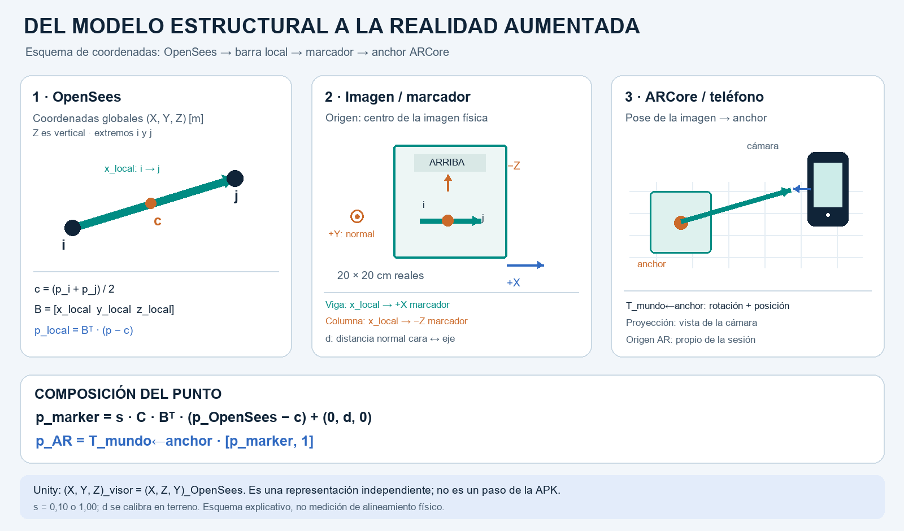
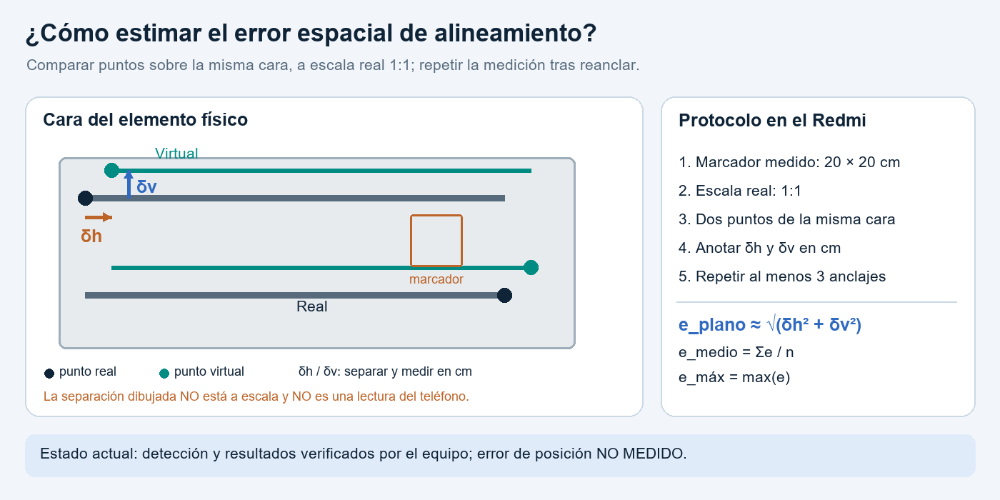
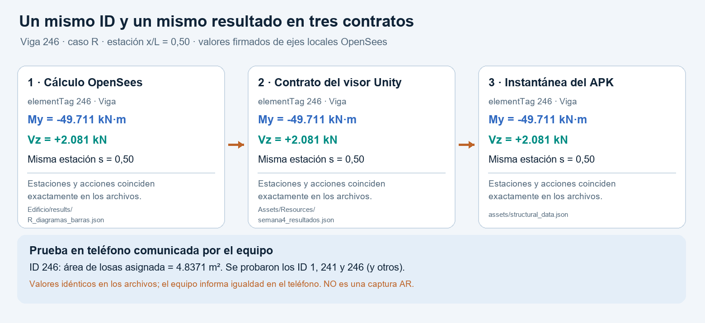

# Informe P1A6 — Validación AR y cierre técnico

- **Asignatura:** Métodos Computacionales en Ingeniería de Obras Civiles
- **Proyecto:** Edificio 3D en OpenSees, visor Unity y aplicación AR nativa Android
- **Plataforma probada:** Xiaomi Redmi Note 9 Pro con ARCore (funcionamiento informado por el equipo)
- **Equipo:** [Integrantes del grupo]
- **Fecha de la prueba en teléfono:** [fecha real por incorporar]
- **Versión de Android:** [versión instalada por confirmar]
- **Versión del proyecto evaluada:** commit **`Entrega P1A6`** en `main`; el hash exacto se informa junto al enlace de entrega en Canvas.

> **Alcance de la evidencia:** el equipo informa que probó la aplicación en el Redmi Note 9 Pro con los marcadores 1, 241 y 246, además de otros, y que los resultados observados coincidían con los del visor Unity. Es una comprobación manual comunicada por el equipo; no se aportaron capturas, fecha de prueba, lectura numérica tomada del teléfono ni medición en centímetros del error de alineamiento. Las figuras explicativas generadas para este informe no se presentan como fotografías de la prueba.

## 1. Flujo AR

La experiencia se implementó como una **aplicación Android nativa con ARCore**, ubicada en `Edificio/visualization/android-ar/`. El visor Unity no se ejecuta dentro de la APK: ambos consumen resultados del mismo modelo, pero la aplicación Android utiliza directamente la cámara y el seguimiento de ARCore. La finalidad de la sesión es asociar la identificación de una imagen impresa con una viga o columna analítica y consultar sus resultados previamente calculados por OpenSees. El flujo implementado es **marker → pose → anchor → transform → elemento → resultado**.

### 1.1 Preparación de la referencia y de los datos

Antes de utilizar el teléfono, `tools/export_ar_data.py` reúne en `app/src/main/assets/structural_data.json` los identificadores, extremos, ejes locales y resultados de **612 vigas y columnas** para G, Q, EX, EY y R. También genera una imagen distinta por `elementTag`; `markers/imprimir.html` permite seleccionar las imágenes que se imprimirán. La imagen completa debe medir **20 × 20 cm**, sin ajuste de escala en la impresora. En la configuración inicial de la aplicación se activan los IDs **1, 241 y 246**; el usuario puede escoger otros IDs existentes, hasta 24 imágenes activas por sesión.

La etiqueta impresa se debe fijar a la cara del **elemento físico que corresponde a ese ID** y centrarse longitudinalmente. La palabra **ARRIBA** y el sentido `i → j` indican su orientación: en una viga, el lado derecho de la imagen apunta de `i` a `j`; en una columna, `ARRIBA` apunta de `i` a `j`. El reconocimiento demuestra qué **imagen** vio la cámara, no identifica automáticamente el hormigón situado detrás de ella. Por ello, la asignación física de cada etiqueta debe contrastarse con los ejes, el piso y las coordenadas del elemento antes de la demostración.

### 1.2 Detección y representación

Al abrir la app, `MainActivity.java` solicita permiso de cámara y prepara la sesión ARCore y una base de imágenes con sus dimensiones físicas. Cada imagen se registra con el nombre `element_<ID>`; el teléfono puede reutilizar una base de imágenes previamente preparada si coinciden los hashes del modelo, de los marcadores y de los IDs seleccionados. En cada cuadro de cámara, `ARRenderer.java` busca una `AugmentedImage` cuyo seguimiento esté en estado `TRACKING` y `FULL_TRACKING`. La **pose** que entrega ARCore describe la ubicación y orientación del centro de la imagen en el mundo AR.

Al detectar una imagen nueva, la aplicación extrae el ID de su nombre y crea un **anchor** en esa pose central. Si había un anchor anterior, lo libera. Con el ID busca el mismo elemento en `structural_data.json`; sin una coincidencia de ID no dibuja una barra arbitraria. Los extremos y ejes locales exportados se trasladan y orientan respecto del centro de la imagen; la pose del anchor los coloca frente a la cámara. La composición precisa de escala, rotación y desplazamiento se desarrolla en la sección 2. Si la imagen sale del encuadre, la aplicación puede conservar la última pose mientras ARCore siga rastreando el anchor; si se pausa el seguimiento, avisa en pantalla. **Reanclar** elimina esa referencia y exige una nueva detección.

Finalmente, el teléfono dibuja el eje y contorno de la barra seleccionada y muestra su **mismo ID analítico**. El usuario elige G, Q, EX, EY o R, la posición entre `i` y `j` y una componente de esfuerzo (`N`, `Vy`, `Vz`, `T`, `My` o `Mz`); **Resultados +** permite consultar desplazamiento, área tributaria, carga directa y curva P–M referencial cuando existe. Los valores y signos provienen del análisis exportado: el teléfono consulta e interpola datos, **no ejecuta OpenSees ni vuelve a calcular la estructura**. La opción **Catálogo** permite leer esos datos sin detectar una imagen y se identifica como selección manual; no constituye evidencia de funcionamiento AR.

| Eslabón del flujo | Dato u operación efectivamente implementada | Resultado de la prueba comunicado / alcance |
|---|---|---|
| **Marker** | Imagen `element_<ID>.png` de 0,20 m de ancho, asociada al ID del contrato. | Se probaron los IDs 1, 241, 246 y otros en el Redmi; no se anotó medida real de impresión. |
| **Pose** | ARCore entrega la pose del centro de una imagen en `FULL_TRACKING`. | La detección funcionó según el equipo; no se registró una pose numérica. |
| **Anchor** | Se crea en `candidate.getCenterPose()`; se conserva mientras esté en `TRACKING` y puede restablecerse con **Reanclar**. | Se informó superposición funcional; no se midió deriva ni se documentó una prueba de oclusión. |
| **Transform** | Extremos y ejes locales OpenSees se orientan, escalan y desplazan respecto del marcador. | El elemento se mostró en AR; no se cuantificó el error espacial (sección 3). |
| **Elemento** | El nombre `element_<ID>` selecciona una viga o columna con el mismo `elementTag` exportado. | Se probaron la columna 1 y las vigas 241 y 246, además de otros IDs no registrados. |
| **Resultado** | Caso, esfuerzos, desplazamientos y demás datos precalculados se consultan por ese ID. | El equipo confirmó que la app muestra los resultados pedidos y que estos se ven iguales en Unity. No se entregó una lectura del teléfono por escrito. |

El APK compiló, y su instantánea se cotejó automáticamente con los archivos exportados. A diferencia de esa comprobación numérica, el funcionamiento en el teléfono fue confirmado por el equipo mediante uso real, pero aún falta un registro de medidas para evaluar la precisión espacial y un acta de los ID/casos ensayados.

## 2. Transformación

La alineación requiere relacionar posiciones calculadas en OpenSees con una imagen cuya pose estima ARCore. **Unity no es un sistema intermedio en la APK:** su visor y la aplicación Android leen datos del mismo edificio, pero cada uno aplica su propia conversión para representarlos. La transformación siguiente corresponde a las vigas y columnas de la aplicación Android, no a una traslación del edificio completo a un origen físico único.

### 2.1 Sistemas y orígenes

| Sistema | Origen y ejes relevantes | Unidades | Uso en esta entrega |
|---|---|---|---|
| OpenSees global | Origen del modelo estructural; `(X,Y,Z)`, con **Z vertical**. | m | Coordenadas de los nodos extremos `p_i` y `p_j`. |
| Barra local OpenSees | Centro `c = (p_i + p_j)/2`; `x_local` apunta de `i` a `j` y `y_local`, `z_local` completan su base ortonormal. | m | Centrar la geometría y conservar los ejes en que se expresan las fuerzas locales. |
| Imagen/anchor ARCore | Centro de la imagen detectada; su plano y normal se orientan según la pose observada. | m; imagen de 0,20 m de ancho | Ubicar el miembro relativo al marcador impreso. |
| Mundo ARCore | Origen arbitrario de la sesión de seguimiento, que no coincide necesariamente con el origen del edificio. | m | El anchor transforma la barra al espacio rastreado por el teléfono. |
| Unity (visor independiente) | `(X,Y,Z)_Unity = (X,Z,Y)_OpenSees`; **Y vertical**. | Geometría representada a escala en m | Permite ver el mismo modelo en la escena Unity; **no interviene** en el cálculo de la pose Android. |

La permutación usada por Unity intercambia Y y Z, por lo que invierte la orientación del sistema; no se debe introducirla como si fuera una rotación rígida entre OpenSees y ARCore. En Android se parte directamente de los ejes locales exportados de OpenSees. Las fuerzas conservan sus signos y unidades originales; las operaciones descritas a continuación sitúan **puntos geométricos**, no recalculan esfuerzos.

### 2.2 Composición aplicada a un punto

Sean `p` un punto global de la barra, `c = (p_i + p_j)/2` su centro y `B = [x_local  y_local  z_local]` la matriz cuyas columnas son los ejes locales exportados. Al ser ortonormal, `Bᵀ(p − c)` expresa el punto en el sistema de la barra. El código `StructuralData.Member.modelToMarker()` implementa esa resta y las tres proyecciones. Después, `localToMarker()` orienta el punto en la imagen mediante `C`:

```text
p_local  = Bᵀ (p_OpenSees − c)
p_marker = s · C · p_local + (0, d, 0)
p_AR     = T_mundo←anchor · [p_marker, 1]
```

Aquí `s` es el factor de escala del miembro, `d` el offset normal a la imagen en **metros AR** y `T_mundo←anchor` la pose del anchor que proporciona ARCore. El término `[p_marker, 1]` expresa el punto en coordenadas homogéneas para aplicar la traslación y la rotación del anchor. `ARRenderer.java` compone esa matriz con las matrices de vista y proyección de la cámara para dibujar el resultado en la pantalla. La orientación local `C` es:

| Tipo de barra | Conversión de coordenadas locales `(x,y,z)` a la imagen | Ubicación del eje `i → j` |
|---|---|---|
| Viga | `C_viga(x,y,z) = (x,z,−y)` | A la derecha del marcador (`+X` de la imagen). |
| Columna | `C_columna(x,y,z) = (y,−z,−x)` | Hacia **ARRIBA** en la imagen (`−Z` de su base). |

Las dos conversiones tienen determinante `+1`: preservan longitudes y orientación, sin reflejar la sección. Como `p_i − c` y `p_j − c` son, respectivamente, `−L/2` y `+L/2` sobre `x_local`, el centro de la barra queda alineado con el centro longitudinal de la imagen antes del offset. Esto justifica colocar la referencia centrada y orientarla según `i → j`; cambiar su posición u orientación física sin recalibrar rompe la correspondencia.

### 2.3 Escala y calibración de la traslación

La aplicación inicia con **Maqueta 1:10** (`s = 0,10`) y permite cambiar a **Escala real 1:1** (`s = 1,00`). La escala afecta a la longitud y sección dibujadas de la barra; **no** cambia el ancho físico de **0,20 m** informado a ARCore para reconocer el marcador. Al alternarla, la aplicación ajusta proporcionalmente el offset configurado.

El offset `d` desplaza el eje analítico en la dirección normal a la imagen: la referencia se pega en una **cara** del elemento, mientras que OpenSees define el miembro por su **eje central**. Por defecto `d = 0`; el usuario puede introducir una distancia firmada tocando la fila de coordenadas. El equipo informó funcionamiento en el teléfono, pero no comunicó el valor de offset utilizado ni su desviación respecto de una medición real. La pose ARCore proporciona la traslación global restante al situar el centro del marcador en el mundo AR.

Esta escala geométrica tampoco debe confundirse con la amplitud de los diagramas 3D de esfuerzos: `ARRenderer.java` normaliza su altura a **0,35 m** para hacerlos legibles, sin atribuirle significado de desplazamiento o longitud física del esfuerzo. La precisión final de la colocación a escala 1:1 requiere la medición independiente planteada en la sección 3.

**Figura 1.** Esquema de la transformación implementada: barra y ejes OpenSees, origen del marcador y colocación mediante el anchor de ARCore. Se generó a partir de la lógica del código; **no representa una medición ni una detección realizada en el edificio**.



## 3. Precisión

### 3.1 Qué se comprobó y qué no mide esa comprobación

Según la prueba manual comunicada por el equipo, el Redmi Note 9 Pro reconoció los marcadores ensayados, mostró el miembro en AR y presentó resultados iguales a los observados en Unity. Eso comprueba el **funcionamiento de la consulta estructural** y permite detectar errores evidentes de identificación. No proporciona, por sí solo, una cifra del **error de posición** entre barra real y virtual: dos modelos pueden mostrar el mismo momento y estar desplazados varios centímetros. El equipo indicó expresamente que **no midió un error de alineamiento aproximado**. Por tanto, no se asigna aquí un error de 0 cm ni una tolerancia supuestamente cumplida.

### 3.2 Estimación simple propuesta para cerrar la validación

Se debe colocar un marcador de **20 × 20 cm medidos** sobre un elemento cuyo ID se conozca y pasar la aplicación a **escala 1:1**. Con el elemento rastreado y el offset normal calibrado, escoger dos referencias observables de una **misma cara o plano** (por ejemplo, dos esquinas o marcas sobre una viga) y comparar cada punto real con el correspondiente punto virtual. En ese plano, medir con una regla las separaciones horizontal `δh` y vertical `δv` en centímetros. Repetir al menos tres anclajes, cambiando ligeramente la posición del teléfono y registrando distancia de observación, iluminación, ID, escala y valor `d` usado. La medida de 20 cm sirve para verificar el tamaño impreso, pero **no convierte automáticamente cualquier distancia de píxeles en centímetros**: perspectiva y profundidad pueden distorsionarla.

```text
Error en el plano para un punto k: e_k ≈ sqrt(δh_k² + δv_k²)     [cm]
Error medio medido:             e_medio = sum(e_k) / n            [cm]
Error máximo medido:            e_max = max(e_k)                  [cm]
```

Si se mide también la diferencia de profundidad `δn` respecto a la cara, puede estimarse `e_3D = sqrt(δh² + δv² + δn²)`; **sin** esa medida, `e_k` solo describe error en el plano observado, no precisión tridimensional. La deriva al ocultar el marcador y volver a mostrarlo debe anotarse por separado de la exactitud inicial del anclaje.

**Resultado de precisión disponible hoy:** reconocimiento y consulta funcional informados por el equipo; **error medio y máximo de alineamiento no disponibles por falta de mediciones**. La cuantificación queda como una actividad pendiente de la validación final; hasta entonces no se puede afirmar que el sistema cumpla una tolerancia espacial determinada.

**Figura 2.** Esquema del método para medir la diferencia entre puntos reales y virtuales. Las separaciones mostradas son variables ilustrativas, **no datos obtenidos del teléfono**.



## 4. Resultados

### 4.1 Elemento, identificación y dato mostrado

La aplicación dispone de un marcador por barra cuyo nombre `element_<ID>` remite al `elementTag` original del modelo. El equipo informó que identificó con el teléfono **la columna 1, las vigas 241 y 246, y otros elementos**; el visor AR mostró resultados que, según su observación, coincidían con los vistos en Unity. No se entregó un inventario de esos otros IDs ni una captura del elemento físico, por lo que la evidencia presentada aquí se limita a la trazabilidad de los tres IDs declarados y a la prueba manual comunicada.

La siguiente tabla reproduce valores **numéricos de los archivos de salida**, no lecturas transcritas de una pantalla. Las coordenadas sirven para ubicar la barra en el modelo y cotejar su piso y su posición con el marcador físico. Para los esfuerzos se usa la estación central `x/L = 0,50` y se conservan los signos de los ejes locales OpenSees.

| Barra / ubicación analítica [m] | ID común OpenSees–Unity–AR | Dato exportado | Lectura en las fuentes | Alcance |
|---|---:|---|---:|---|
| Columna: `i=(0; 0; 0)`, `j=(0; 0; 3,96)` | **1** | Caso R: `P = N` en `x/L=0,50` | **+778,316 kN** | Compresión positiva según el diagrama local; curva P–M nominal de referencia disponible (7 puntos). |
| Viga: `i=(35; 0; 7,92)`, `j=(35; 7,25; 7,92)` | **241** | Losa asociada: área directa; carga Q directa | **23,7500 m²; 93,163 kN** | Reparto recibido de losas; no es demanda axial ni capacidad. |
| Viga: `i=(25; −2,46; 11,88)`, `j=(30; −2,46; 11,88)` | **246** | Caso R: `My` y `Vz` en `x/L=0,50` | **−49,711 kN·m; +2,081 kN** | Acciones locales firmadas; área de losas asociada: **4,8371 m²**. |

En la viga 246, las listas completas de estaciones `s`, `n`, `vy`, `vz`, `t`, `my` y `mz` coinciden **exactamente** entre `Edificio/results/R_diagramas_barras.json`, el caso R de `Assets/Resources/semana4_resultados.json` consumido por Unity y `app/src/main/assets/structural_data.json` incluido en Android. La Figura 3 se genera leyendo y comprobando estos tres archivos antes de dibujarla. El verificador `tools/verify_ar_data.py` contrasta además las estaciones y los desplazamientos nodales de los **612 elementos** exportados; `tools/verify_apk.py` comprueba que la APK firmada contiene la instantánea actual. Esta es una evidencia reproducible de **identidad del ID y de los números exportados**, distinta de una fotografía de reconocimiento físico.

**Figura 3.** Trazabilidad numérica del elemento 246 para el caso R. Los valores proceden de los archivos comprobados; la mención de la prueba en el Redmi corresponde a lo informado por el equipo, **no** a una captura tomada desde el teléfono.



### 4.2 Alcance de los resultados disponibles en AR

En la pantalla principal se muestran `N` (axial `P` con la convención local explícita), `Vy`, `Vz`, `T`, `My`, `Mz` y sus diagramas para los casos **G, Q, EX, EY y R**. El control de posición permite consultar puntos intermedios de la barra. **Resultados +** muestra `Ux`, `Uy` y `Uz` en mm, obtenidos de desplazamientos y giros nodales previamente resueltos; área tributaria y losas que descargan **directamente** en esa barra; y cargas gravitatorias directas G/Q con sus unidades. Un área directa de cero en una columna no significa que carezca de fuerzas provenientes del marco. En EX/EY la carga sísmica se aplica en nodos de diafragma; no se presenta como si fuera una carga distribuida sobre cada barra.

La curva P–M se habilita para las columnas de hormigón de la sección de referencia que poseen capacidad exportada. El punto de demanda se muestra como una lectura **referencial** frente a una envolvente **uniaxial**; no equivale a una verificación normativa biaxial. Las vigas y los perfiles sin esa capacidad deben indicar que la curva no está disponible. En todos los casos, el teléfono utiliza resultados **precalculados**: la coincidencia de valores observada con Unity no implica que OpenSees se haya ejecutado en Android.

### 4.3 Alcance de la correspondencia física

La cadena de archivos prueba que un marcador llamado `element_246` accede a la barra analítica 246 y a los resultados de esa misma barra. Según el equipo, esa correspondencia también se probó con el teléfono para los IDs 1, 241 y 246 y otros marcadores. La ubicación y orientación **físicas** de cada etiqueta dependen, sin embargo, de cómo se instaló sobre el elemento real. Sin una foto, un registro de ubicación en planos o un acta de terreno no es posible reconstruir aquí, de forma independiente, exactamente qué cara del edificio se utilizó. Esa limitación documental no debe confundirse con una falla de los resultados exportados.

## 5. QA final estructural

La QA distingue los controles **numéricos repetibles** sobre el modelo regenerado desde sus fuentes, las **pruebas manuales en Android comunicadas por el equipo** y las mediciones que aún faltan. No se atribuye a una foto, a un código de salida exitoso o a la concordancia visual de resultados una comprobación de equilibrio que no se haya calculado. Tras detectar un JSON de modelo no reproducible, se reconstruyeron modelo, resultados, contrato Unity y APK; se incorporan **juntos** a la entrega `Entrega P1A6`. El hash exacto se comunica al subir ese commit.

| Prueba | Estado | Criterio, resultado y evidencia |
|---|---|---|
| Equilibrio G | **OK numérico** | Error relativo de equilibrio apoyos/carga `6,516 × 10⁻⁹` < `1 × 10⁻⁴`; `Edificio/results/resumen_global.json`. |
| Equilibrio Q | **OK numérico** | Equilibrio `3,079 × 10⁻⁹` < `1 × 10⁻⁴`; conservación en 652 losas con error máximo de piso `4,855 × 10⁻⁵ kN` < `0,002 kN`. |
| Corte basal EX | **OK numérico** | Error relativo `3,068 × 10⁻⁷` < `1 × 10⁻⁴`; controles de `resumen_global.json` y `verificaciones_globales.csv`. |
| Corte basal EY | **OK numérico** | Error relativo `1,036 × 10⁻⁷` < `1 × 10⁻⁴`; mismas fuentes de resultados. |
| Superposición | **OK numérico** | `verificar_semana05.py`: 120 comparaciones por estado/componente bajo tolerancia relativa `1 × 10⁻⁵` frente a soluciones explícitas. |
| M-φ | **OK numérico del modelo** | `Edificio/results/resumen_capacidad.json` declara `estado: OK`; curvas terminan por límite de deformación, error relativo de malla `7,427 × 10⁻⁴` y error axial `8,883 × 10⁻⁸ kN`. Datos: `momento_curvatura.csv`. No es un ensayo físico. |
| P-M columna | **OK numérico, referencial** | Capacidad nominal exportada para columna HA; `verificar_pm_excel.py` reproduce la planilla externa con diferencias máximas `1,82 × 10⁻¹² kN` y `6,82 × 10⁻¹³ kN·m`, **usando sus barras Ø22**. El modelo activo usa Ø28; la planilla no valida su detalle constructivo. |
| P-M muro | **OK numérico, con hipótesis** | `resumen_capacidad_muros.json`: 24 muros origen, 82 paños/secciones y `estado: OK`. Armaduras de confianza media/baja deben revisarse con planos antes de diseño. |
| IDs Unity | **OK en contrato; coincidencia visual informada** | 33/33 pruebas unitarias; nodos, barras, esfuerzos y desplazamientos cotejados. El equipo informa haber observado los mismos resultados en el visor Unity y en Android para los IDs ensayados. |
| AR | **Funciona según prueba manual; precisión no cuantificada** | Equipo: Redmi Note 9 Pro, marcadores 1, 241, 246 y otros, resultados visibles concordantes con Unity. Automático: 612 IDs/estaciones coinciden con fuentes, `verify_apk.py` compara datos e imágenes internos, Gradle/lint y firma APK OK. Sin fecha, lectura registrada ni error de alineamiento en cm; calidad de imágenes nuevas sin evaluar con `arcoreimg`. |

Como controles complementarios, `Edificio/results/resumen_global.json` contiene **72/72** verificaciones en `OK` y ninguna en `REVISAR`; la auditoría SQ4 informa **10 686/10 686** controles en `OK`, con 652 paneles. Los resultados de demanda-capacidad registran **1650/1650** revisiones dentro de las envolventes nominales (`verificacion_demanda_capacidad.json`), sin sustituir una revisión normativa. La información AR se rastrea mediante los hashes de `Edificio/visualization/android-ar/verification.json` y `dist/delivery.json`. Este último conserva `physical_device_test: PENDING` porque el verificador automático **no incorpora la declaración manual del equipo**; no debe interpretarse como prueba de que la app falló en el Redmi ni como certificación automática de la prueba comunicada.

Para repetir la QA numérica desde la raíz del repositorio:

```powershell
python Edificio/model/builders/generar_modelo_manual.py
python Edificio/analysis/load_cases/ejecutar.py --carga-movil
python Edificio/verification/load_transfer/verificar_reparto_combinacion.py
python Edificio/verification/interactive/verificar_semana05.py
python Edificio/verification/capacity/verificar_pm_excel.py
python -m unittest discover -s Edificio/verification/tests -p "test_*.py"
python Edificio/visualization/android-ar/tools/export_ar_data.py
python Edificio/visualization/android-ar/tools/verify_ar_data.py
python Edificio/visualization/android-ar/tools/verify_apk.py
```

Al reconstruir el modelo, los recursos Unity o el paquete AR, se debe volver a comprobar que los hashes del modelo y de los resultados coincidan: mezclar una APK antigua con salidas nuevas daría números plausibles pero ya no verificables para la misma geometría.

## 6. Errores conocidos

La prueba funcional del teléfono no elimina automáticamente las limitaciones de la idealización estructural ni las tareas de QA sin evidencia cuantitativa. Se separan incidencias **corregidas**, verificaciones **pendientes** y limitaciones **intrínsecas** del modelo, indicando cómo afectan la interpretación.

| Incidencia o límite | Observación y efecto | Estado y acción necesaria | Evidencia |
|---|---|---|---|
| Salidas estructurales desincronizadas (histórica, corregida en esta entrega) | Un JSON generado subido contenía **656 losas y 1256 nodos**; los datos fuente reproducen **652 y 1251**. Antes fallaban 5/33 pruebas y los hashes SQ4/Unity no correspondían al mismo modelo. | Se reconstruyeron geometría, casos, SQ4, recursos Unity y APK: **33/33** pruebas, **72/72** controles globales y **10 686/10 686** SQ4 OK. Los archivos coherentes se versionan juntos en `Entrega P1A6`. | `modelo_3d_manual.json`, `resumen_global.json`, `verificacion_carga_movil.json` y `dist/delivery.json`. |
| Error espacial AR sin medición | El equipo informa que se ven el modelo y sus resultados en el Redmi, pero no dispone de error lateral, vertical o normal medido. La igualdad con Unity se refiere al **resultado estructural**, no a una exactitud de posición en centímetros. | Función manual comprobada; **precisión cuantitativa pendiente**. Medir puntos y reanclajes como en la sección 3 antes de afirmar una tolerancia espacial. | Sección 3: tabla de medidas aún sin cifras. |
| Calidad de algunos marcadores sin puntuación oficial | Tras la regeneración se añadieron imágenes de IDs **344, 431 y 653**; no se ejecutó `arcoreimg.exe` sobre el conjunto nuevo. La detección comunicada de los IDs 1, 241 y 246 no demuestra calidad de esos tres marcadores. | `marker_quality_status: PENDING`. Ejecutar `arcoreimg eval-img` para las imágenes nuevas y registrar las puntuaciones; no reutilizar la puntuación mínima del conjunto anterior. | `Edificio/visualization/android-ar/verification.json` y `dist/delivery.json`. |
| Asignación física del marcador | La cámara identifica **imágenes**, no reconoce por sí sola la barra real; un marcador mal ubicado asociaría correctamente un ID a un elemento físico equivocado. El equipo no entregó bitácora de piso, eje y cara de cada etiqueta probada. | Contrastar en terreno las coordenadas, nodos `i/j` y orientación de los IDs mostrados con el elemento etiquetado. | `markers/imprimir.html`, `markers/catalog.json` y la sección 4. |
| Curvas de capacidad y cargas simplificadas | Las losas se modelan por reparto tributario, no como placas; el P–M de columna es nominal/uniaxial, y la armadura de algunos muros procede de asignaciones de confianza media/baja. La app solo presenta curvas P–M cuando existen; una columna puede mostrar área de losa directa cero y aun así transmitir fuerzas recibidas de vigas. | Los resultados son didácticos y no sustituyen diseño normativo ni comprobación de armaduras en planos. | `Edificio/results/README.md`, `resumen_capacidad_muros.json`, `Edificio/visualization/android-ar/README.md`. |

ARCore puede perder seguimiento con oclusión, movimiento o iluminación desfavorable; **no se informa una deriva observada** porque no se midió. La aplicación ofrece **Reanclar** y permite activar hasta 24 imágenes por sesión. El catálogo muestra resultados sin cámara, pero no demuestra identificación AR de un elemento físico. Deben registrarse por separado una prueba de detección y cualquier consulta manual en catálogo.


## 7. Plan final

El **núcleo funcional** ya incluye los casos de carga, la detección de imágenes, el anchor, la transformación, el ID y la consulta en el Redmi comunicada por el equipo. El cierre técnico requiere asegurar que la versión **publicada** incluya los resultados que aprobaron las pruebas y completar la medición de precisión. Las mejoras de presentación y extensiones opcionales se mantienen separadas de esa obligación.

| Categoría | Tarea concreta | Estado / prioridad | Criterio de cierre |
|---|---|---|---|
| Núcleo | Demostrar detección de marcador, pose, anchor, elemento con el mismo ID y resultado G/Q/EX/EY/R en Redmi Note 9 Pro. | Implementado y **comunicado como probado manualmente** para IDs 1, 241, 246 y otros. | Registrar fecha, versión Android y al menos un ID/caso/valor consultado durante la demostración; distinguir modo AR de catálogo. |
| Núcleo | Medir el error de alineamiento de dos puntos de un elemento en escala 1:1 y repetir tras reanclar. | **Pendiente: prioridad alta** para satisfacer precisión P1A6. | Completar `δh`, `δv`, `e_medio` y `e_max` en cm con condiciones de medición; si no se realiza, declarar explícitamente que la precisión quedó sin estimar. |
| Núcleo | Publicar juntos modelo reproducible, resultados Unity, bases SQ4, instantánea, marcadores y APK Android. | Regenerados, comprobados y preparados en `Entrega P1A6`. | Confirmar el commit en `main` y entregar su hash exacto en Canvas; si cambian los datos, repetir 33/33 pruebas, 72 controles globales, 10 686 SQ4 y la verificación de hashes. |
| Núcleo | Completar la trazabilidad física de la etiqueta a piso, eje y cara del elemento de prueba. | Prueba de IDs reportada; bitácora de emplazamiento pendiente. | Registrar un elemento real, `elementTag`, extremos `i/j`, ubicación y resultado firmado de un caso; poder explicarlo en vivo. |
| Polish | Evaluar la calidad de las tres imágenes nuevas, contrastar legibilidad de unidades y mejorar indicaciones de seguimiento/reanclaje. | Pendiente, sin bloquear las pruebas numéricas existentes. | Puntuaciones `arcoreimg` de la nueva base y revisión de uso en el Redmi documentadas. |
| Honors | Explorar calibración con varios marcadores, selección por planta y actualización controlada de instantáneas. | Propuesta opcional, **no implementada ni validada** en esta entrega. | Prototipo y verificación propios solo después de cerrar el núcleo. |
